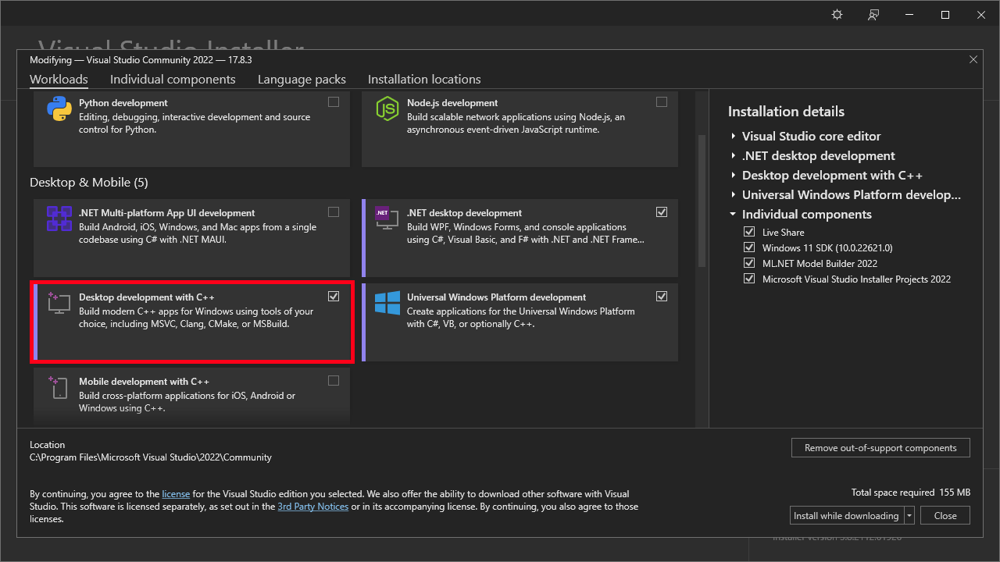

# .NET AOT Compilation

## Table Of Contents
- [Intro](#intro)
- [What is AOT Compilation](#what-is-aot-compilation)
- [Pros and Cons of Having a Runtime](#pros-and-cons-of-having-a-runtime)
- [Advantages of AOT Compilation](#advantages-of-aot-compilation)
  - [Startup Time](#startup-time)
  - [Interoperability](#interoperability)
- [Availability](#availability)
- [Limitations](#limitations)
- [How To do AOT Compilation](#how-to-do-aot-compilation)
  - [Set up The ASP.NET Web API (AOT) Template](#set-up-the-aspnet-web-api-aot-template)
- [AOT Configurations](#aot-configurations)
  - [Size or Speed](#size-or-speed)
  - [Trimming](#trimming)
    - [TrimmerRemoveSymbols](#trimmerremovesymbols)
    - [DebuggerSupport](#debuggersupport)
    - [UseNativeHttpHandler](#usenativehttphandler)
    - [StackTraceSupport (.NET 8+)](#stacktracesupport-net-8)
- [My Experience](#my-experience)
- [Closing Notes](#closing-notes)

## Intro
This Month i was interested in AOT Compilation in .NET. 
It is a new way to compile your .NET project. 
Microsoft is heavily investing in AOT compilation at the moment. 
Which is reflected in the changes that have come with .NET 8 and C# 12. 
I think AOT compilation is a very good direction for .NET and has a lot of applications. 

## What is AOT Compilation
AOT stands for Ahead-of-Time. With AOT compilation you can directly compile to native code. So what's the difference to how we traditionally compile our C# applications? 
Usually when you compile C# the [Roslyn compiler](https://github.com/dotnet/roslyn) generates CIL ([Common Intermediate Language](https://en.wikipedia.org/wiki/Common_Intermediate_Language)) (Also sometimes called MSIL (Microsoft Intermediate Language) or just IL (Intermediate Language).) 
code which is executed by the CLR ([Common Language Runtime](https://learn.microsoft.com/en-us/dotnet/standard/clr)). 
The [JIT compiler](https://en.wikipedia.org/wiki/Just-in-time_compilation) which is part of the CLR then compiles it piece for piece into native code for the current platform and architecture while your application is running. 
AOT compilation on the other hand compiles your code directly into native code similar to how other languages like C/C++ and GO are compiled. This removes the need for the CLR.
Note that some parts of the CLR like the garbage collector are is still included in the application. 
This is similar to GO which is also a garbage-collected language and also needs to ship a garbage collector with each application. 

## Pros and Cons of Having a Runtime
**Pro:** 
* The CIL is platform independent. The same CIL can be run on different operating systems and architectures.
* The JIT compiler can make platform specific optimisations when generating native code.
* The JIT compiler can look at the behavior of the application and optimize the native code based on that.

**Con:**
* The .NET CLR must either be installed on the target machine or has to be bundled with the application. The latter also removes portability and increases the application size.
* Longer startup time. This is because the JIT compiler needs to compile each method before it can be executed.
* The CIL code may also be compiled a second time (Tier 1 compilation) based on how many times it is executed. A method that is executed a lot is also called "hot". The second compilation takes more processing time but produces faster native code.
  This is called [Tiered Compilation](https://github.com/dotnet/runtime/blob/main/docs/design/features/tiered-compilation.md) and was [introduced in .NET Core 3.0](https://learn.microsoft.com/en-us/dotnet/core/runtime-config/compilation#tiered-compilation). 
  There are now actually more the 2 compilations (This was introduced in .NET 7 and was set as the default in .NET 8.) for more about that read [PR#70941 on the dotnet/runtime repository](https://github.com/dotnet/runtime/pull/70941).
  This processing time can be partially elevated by a [ReadyToRun Compilation](https://learn.microsoft.com/en-us/dotnet/core/deploying/ready-to-run) which does some of the work of the JIT compiler at regular compile time but also removes portability. 
  Additionally, the CLR also needs to start before your application can.
* It becomes harder for other languages to call .NET libraries. ([Interoperability](https://en.wikipedia.org/wiki/Language_interoperability))

## Advantages of AOT Compilation
We have discussed the pros and cons of having a runtime. Now how can AOT compilation help?

### Startup Time
AOT compilation can drastically reduce startup time. 
This is because the CLR itself also has a startup time and only after the CLR has started can your application start. 
At which point your code also has to get JIT compiled and only after all that will your first line of code get executed.
For the ASPNET API template the average startup times are 350ms for regular compilation and only 45ms for AOT compilation in the benchmark in [this article](https://andrewlock.net/exploring-the-dotnet-8-preview-the-minimal-api-aot-template/).
This is a very extreme example. The extra 300ms obviously make less of a difference when your application needs 5s to start.
In conclusion, applications that have a short startup time by themselves profit the most by removing the JIT compilation step.
This makes AOT compilation a great choice for deployments such as [AWS Lambda functions](https://docs.aws.amazon.com/lambda/latest/dg/dotnet-native-aot.html) or [Kubernetes](https://kubernetes.io/), as nodes have reduced startup time.

### Interoperability
Being compiled to native code makes it a lot easier for other languages to use C# libraries.
[This article](https://joeysenna.com/posts/nativeaot-in-c-plus-plus) explains how to create a native library in C# (.NET 7) and how to use it in C++. 

## Availability
Support for AOT compilation was [moved from experimental in .NET 7 preview 2](https://devblogs.microsoft.com/dotnet/announcing-dotnet-7-preview-2/). But in .NET 7 support for AOT was limited to console apps and class libraries.\
In .NET 8 this support was expanded and also includes support for many ASPNET application types. 
More about ASPNET AOT compatibility and performance can be found [here](https://learn.microsoft.com/en-us/aspnet/core/fundamentals/native-aot?view=aspnetcore-8.0).
In .NET 8 AOT compilation can also be used in some UI Frameworks.
[Avalonia UI](https://www.avaloniaui.net/) and the [Uno Platform](https://platform.uno/) both support AOT compilation.
AOT was also mentioned in the [WPF Roadmap 2023](https://github.com/dotnet/wpf/blob/main/roadmap.md) as a long term goal. 

## Limitations
There are some limitations for AOT compiled applications. These are the main ones:
1. Your application and it's dependencies must support [trimming](https://learn.microsoft.com/en-us/dotnet/core/deploying/trimming/prepare-libraries-for-trimming).
2. Your application must support compilation into a single file. ([Single-file deployment](https://learn.microsoft.com/en-us/dotnet/core/deploying/single-file/overview?tabs=cli))
3. Most operations that require [reflection](https://learn.microsoft.com/en-us/dotnet/framework/reflection-and-codedom/reflection) are not compatible.

These limitations can make it difficult to make existing projects AOT compatible. 
For example if you are using [AutoMapper](https://github.com/AutoMapper/AutoMapper) your application is not AOT compatible. 
You would need so switch to a mapper that uses source generation instead of reflection like [Mapperly](https://github.com/riok/mapperly).

Also note that AOT cross compilation only works across different architectures and not across different operating systems. More information about this can be found [here](https://learn.microsoft.com/en-us/dotnet/core/deploying/native-aot/cross-compile).

## How To do AOT Compilation
To AOT compile your project you will need to set the following property in your `.csproj` file.
```xml
<PublishAot>true</PublishAot>
```
If you now publish your project it will be AOT compiled. 

.NET 7
```bash
dotnet publish -c release
```
.NET 8
```bash
dotnet publish
```
Starting from .NET 8 release is the default configuration for publish.

### Set up The ASP.NET Web API (AOT) Template
1. Check that .NET 8 is installed.

   You can do this by using the following command
   ```bash
   dotnet --list-sdks
   ```

   example output:
   ```
   teddy@teddy MINGW64 ~
   $ dotnet --list-sdks
   5.0.408 [C:\Program Files\dotnet\sdk]
   6.0.412 [C:\Program Files\dotnet\sdk]
   7.0.101 [C:\Program Files\dotnet\sdk]
   7.0.400 [C:\Program Files\dotnet\sdk]
   8.0.100 [C:\Program Files\dotnet\sdk]
   ```

2. Install necessary tools.

   To be able to do AOT compilation we need some extra tools. Here is how to install them on your platform.
   **On Windows:**\
   The easiest way to get the required tools on windows is by installing the "Desktop development with C++" package in the Visual Studio Installer.

   

   **On Linux:**\
   The Tools required depend on the Linux distribution you are using. 
   To find out which, it is easiest to just run the AOT compilation and looking which tools it is not finding.

3. Create the project.

   Create the project from the `webapiaot` template with the [dotnet new](https://learn.microsoft.com/en-us/dotnet/core/tools/dotnet-new) command.
   ```bash
   dotnet new webapiaot -n MyAOTWebAPI
   ```

   This template creates a new [ASP.NET Minimal API](https://learn.microsoft.com/en-us/aspnet/core/tutorials/min-web-api?view=aspnetcore-8.0&tabs=visual-studio) that is AOT compatible.
   The AOT compatible Minimal API uses the new [interceptor](https://khalidabuhakmeh.com/dotnet-8-interceptors) feature from .NET 8 instead of reflection to map endpoints. 

   example output:
   ```
   teddy@teddy MINGW64 /c/DEV
   $ dotnet new webapiaot -n MyAOTWebAPI
   The template "ASP.NET Core Web API (native AOT)" was created successfully.
   
   Processing post-creation actions...
   Restoring C:\DEV\MyAOTWebAPI\MyAOTWebAPI.csproj:
     Determining projects to restore...
     Restored C:\DEV\MyAOTWebAPI\MyAOTWebAPI.csproj (in 364 ms).
   Restore succeeded.
   ```

   This will create the `MyAOTWebAPI` project.

4. Publish project AOT compiled

   Run the following command to publish the project
   ```bash
   dotnet publish ./MyAOTWebAPI/MyAOTWebAPI.csproj
   ```

   example output:
   ```
   teddy@teddy MINGW64 /c/DEV
   $ dotnet publish ./MyAOTWebAPI/MyAOTWebAPI.csproj
   MSBuild version 17.8.3+195e7f5a3 for .NET
     Determining projects to restore...
     Restored C:\DEV\MyAOTWebAPI\MyAOTWebAPI.csproj (in 1.97 sec).
     MyAOTWebAPI -> C:\DEV\MyAOTWebAPI\bin\Release\net8.0\win-x64\MyAOTWebAPI.dll
     Generating native code
     MyAOTWebAPI -> C:\DEV\MyAOTWebAPI\bin\Release\net8.0\win-x64\publish\
   ```

   On the last line of the output you can see where the published AOT compiled application is located.
   In this example i have created a win-x64 application. This application will run on 64-Bit Windows operating systems running a CPU with the x86 architecture.

5. Running the project.

   First navigate to the output folder.

   example:
   ```bash
   cd ./MyAOTWebAPI/bin/Release/net8.0/win-x64/publish
   ```

   Now run the compiled application. The filename of the application depends on the platform it was compiled for (windows: MyAOTWebAPI.exe, linux: MyAOTWebAPI).

   on windows:
   ```bash
   ./MyAOTWebAPI.exe
   ```

   on Linux:
   ```bash
   ./MyAOTWebAPI
   ```

## AOT Configurations
Most of the information about this comes from the ["Optimize AOT deployments"](https://learn.microsoft.com/en-us/dotnet/core/deploying/native-aot/optimizing) and ["Trimming options"](https://learn.microsoft.com/en-us/dotnet/core/deploying/trimming/trimming-options?pivots=dotnet-8-0) article.

### Size or Speed
The `OptimizationPreference` property that can be set in the `.csproj`. 
This decides the priority of the compiler between creating the smallest application size and the fastest application speed.
By default, the compiler chooses a blend between both. For the `webapiaot` template (MyAOTWebAPI) compiled for win-x64 this creates the following application sizes:\
size => 8.8 MB\
not set => 9.1 MB\
speed => 9.7 MB\
This option would most likely make a larger impact in a bigger application.
**Options:**
* Size
* Speed

### Trimming
As mentioned before AOT compilation also requires trimming. Configuring the trimming can further reduce the application size. 
Here are some options i found interesting.

#### TrimmerRemoveSymbols
This property determines whether to remove [symbols](https://learn.microsoft.com/en-us/dotnet/core/diagnostics/symbols).
**Options:**
* true
* false

#### DebuggerSupport
This property determines whether debugging information and symbols are included.
**Options:**
* true
* false

#### UseNativeHttpHandler
For Android and IOS this property determines whether to use the platform implementation of HttpMessageHandler instead of the .NET implementation
**Options:**
* true
* false

#### StackTraceSupport (.NET 8+)
Setting this property to false removes code that is required for the runtime to create stacktraces.
Note this doesn't remove stacktraces completely. The stacktraces will just start looking like this:
```
fail: Microsoft.AspNetCore.Server.Kestrel[13]
      Connection id "0HN0MEBT0QLKU", Request id "0HN0MEBT0QLKU:00000001": An unhandled exception was thrown by the application.
      System.Exception: My Exception
         at MyAOTWebAPI!<BaseAddress>+0x17a98c
         at MyAOTWebAPI!<BaseAddress>+0x17b73c
         at MyAOTWebAPI!<BaseAddress>+0x1159c9
         at MyAOTWebAPI!<BaseAddress>+0x116777
         at MyAOTWebAPI!<BaseAddress>+0x1309c9
         at MyAOTWebAPI!<BaseAddress>+0x402f6f
```
instead of this:
```
fail: Microsoft.AspNetCore.Server.Kestrel[13]
      Connection id "0HN0MECLC6T9P", Request id "0HN0MECLC6T9P:00000001": An unhandled exception was thrown by the application.
      System.Exception: My Exception
         at Program.<>c__DisplayClass0_0.<<Main>$>b__2(Int32 id) + 0x3c
         at Microsoft.AspNetCore.Http.Generated.<GeneratedRouteBuilderExtensions_g>F69328E0708B4B584C5AACA22FE2C51A1CF192D6622828F613FC57C583CA77B63__GeneratedRouteBuilderExtensionsCore.<>c__DisplayClass3_0.<MapGet1>g__RequestHand
ler|4(HttpContext httpContext) + 0x17c
         at Microsoft.AspNetCore.Routing.EndpointMiddleware.Invoke(HttpContext httpContext) + 0x299
         at Microsoft.AspNetCore.Routing.EndpointRoutingMiddleware.Invoke(HttpContext httpContext) + 0x377
         at Microsoft.AspNetCore.HostFiltering.HostFilteringMiddleware.Invoke(HttpContext context) + 0x109
         at Microsoft.AspNetCore.Server.Kestrel.Core.Internal.Http.HttpProtocol.<ProcessRequests>d__238`1.MoveNext() + 0x36f
```
**Options:**
* true
* false

## My Experience
I have created a console app version of the classic mobile game [Timberman](https://play.google.com/store/apps/details?id=com.dm.timber) called [TreeCutterTUI](https://github.com/Teddy55Codes/TreeCutterTUI) to test the new AOT compilation.
I have developed this game both from a Linux and Windows and the AOT compilation worked perfectly on both.

### Closing Notes
It was interesting to see that some .NET features only work in a JIT compiled environment and how to work around this with things like source generators. 
For next month i will probably choose the topic "JIT compilation". While researching this month's topic i fell down a rabbit hole on the C# JIT compiler. It is a very interesting topic. 
