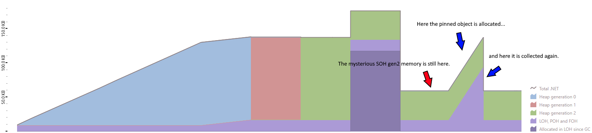

# Memory Management In C# and .NET

- [Memory Safety](#memory-safety)
  - [Memory Safety Overview](#memory-safety-overview)
  - [How C# Handles Memory Safety](#how-c-handles-memory-safety)
- [How .NET Manages Memory](#how-net-manages-memory)
  - [Stack Memory](#stack-memory)
  - [Heap Memory](#heap-memory)
    - [Difference Server And Workstation Garbage Collector](#difference-server-and-workstation-garbage-collector)
    - [Small Object Heap](#small-object-heap)
    - [Large Object Heap](#large-object-heap)
    - [Pinned Object Heap](#pinned-object-heap)
      - [What Are Pinned Objects](#what-are-pinned-objects)
    - [Frozen Object Heap / NonGC Heap](#frozen-object-heap--nongc-heap)
  - [Memory space visualization](#memory-space-visualization)
  - [Memory Analysis](#memory-analysis)
    - [Stack allocation](#stack-allocation)
    - [Heap allocation](#heap-allocation)
      - [SOH](#soh)
      - [LOH](#loh)
      - [POH](#poh)
      - [FOH](#foh)
    - [Conclusion](#conclusion)
- [Closing Notes](#closing-notes)

## Memory Safety
C# is a memory safe language. That means it protects the programmer (at least to some extent) from causing memory bugs like:
* Access errors: invalid read/write of a pointer\
  Reading/Writing a piece of memory that is not intended to be read/written to.
  This includes [buffer over read](https://en.wikipedia.org/wiki/Buffer_over-read) the type of memory bug that was responsible for the famous [Heartbleed](https://en.wikipedia.org/wiki/Heartbleed) vulnerability.
* Uninitialized variables\
  An uninitialized variable is a variable that has not yet received an explicit value. In languages like C and C++ the compiler does not stop you from reading such a variable.
  This can lead to data being read that was at that place in memory before.
* Memory leak\
  A memory leak occurs when memory is not freed after use.
  This bug can cause applications to be extra susceptible to denial of service attacks.

### Memory Safety Overview
The document [The Case for Memory Safe Roadmaps](https://www.cisa.gov/sites/default/files/2023-12/The-Case-for-Memory-Safe-Roadmaps-508c.pdf) Published by some of the top security agencies of the world lays out the scope of the problem with memory unsafe languages.
Here a short excerpt from the Introduction of the document:
```
• About 70 percent of Microsoft common vulnerabilities and exposures (CVEs) are
  memory safety vulnerabilities (based on 2006-2018 CVEs).
• About 70 percent of vulnerabilities identified in Google’s Chromium project are
  memory safety vulnerabilities.
• In an analysis of Mozilla vulnerabilities, 32 of 34 critical/high bugs were memory
  safety vulnerabilities.
• Based on analysis by Google’s Project Zero team, 67 percent of zero-day
  vulnerabilities in 2021 were memory safety vulnerabilities.
```
Recently even the White House has published a report on the issue of memory safety [BACK TO THE BUILDING BLOCKS: A PATH TOWARD SECURE AND MEASURABLE SOFTWARE](https://www.whitehouse.gov/wp-content/uploads/2024/02/Final-ONCD-Technical-Report.pdf).

This all sounds very concerning, but how can we move to MSLs (Memory Safe Languages) as recommended?
As mentioned in the sited articles a transition towards MSLs will take a long time and will require the adoption of new technologies like Rust.
With the emergence of Rust there is finally a memory safe systems programming language. 
This makes the transition towards MSLs becomes feasible even in environments where resources are very limited. 
I, for one, am excited for the day when all new satellites will run Rust.

### How C# Handles Memory Safety
C# has automatic memory management. This is facilitated by both the compiler and the runtime.
First the compiler sets some rules these include:
* Memory Type Safety\
  Memory type safety enforces access to memory for example that a private field can not be accessed outside its class or that memory held by an internal class can not be accessed from another assembly.
* Compile Time Analysis\
  Roslyn has some build in rules to avoid memory errors for example CS0165 (Use of unassigned local variable)
  an error that protects from accessing uninitialized variables.

The main part of ensuring memory safety is done by the runtime. The first component that comes to mind is definitely the garbage collector. 
It manages most objects on the heap. It optimizes access to them and frees no longer used ones. 
But it is not the only check in place there is also bound checking, auto initializing variables to default values, thread management and many others.

## How .NET Manages Memory
In .NET as in most environments There are 2 main memory spaces the stack and the heap. 

### Stack Memory
The stack is for short-lived set length data and pointers to items on the heap. 
Accessing the stack is very fast. This speed is archived because of the restrictive rules imposed on it.
By default, the stack is 1MB in size. 
As mentioned before it only holds set length data so a list for example could not be saved on the heap.
This is because data is saved right next to another and never moved (only replaced by new data). So an object like a list can not grow. 

The stack is also not managed by the GC. Memory is freed when the variable holding the memory is not in scope anymore. 
As the name suggests the stack works in LIFO (last in first out) order. 
The stack contains the following things:
* pointers to objects on the heap
* value types
  This needs some further elaboration. Not all value types are stored on the stack. 
  The following value types are not stored on the stack:
  * fields of classes
  * boxed values
  * local value types that are outer variables of anonymous methods
  * local value types that are outer variables of iterator blocks

### Heap Memory
The heap is a lot slower but is also not as restrictive as the stack. The Heap also doesn't have a fixed size. 
If more space is required more space is requested from the operating system. 
It is also not organized like the stack. On the heap data is scattered around. (Although the GC does do consolidation/compacting. Where it places objects in the vicinity of each other for faster access.)
Data on the heap is found via pointers that are stored on the stack. 
C# organizes its stack into different sectors. Objects are spread across these sectors depending on there type and purpose.

#### Difference Server And Workstation Garbage Collector
There is one detail to add here when talking about the different heap sections. 
When using server GC each logical CPU thread has its own heap while on workstation GC there is only one. 

#### Small Object Heap
The Small Object Heap holds the larges amount of objects. 
Most objects you allocate that don't land on the stack are stored here.
The SOH is split into different generations. Objects allocated on the SOH start in generation 0. on each GC collection all survivors are promoted a generation up. 
So gen 0 objects go to gen 1, gen 1 objects got to gen 2 and gen 2 objects stay in gen 2. 
This generational divide is made to shorten GC time. gen 2 objects get checked for collection a lot less often then gen 0 objects. This is handled through different types of GC collections. 
The GC can decide if it wants to make a gen 0, gen 1 or a gen 2 (also called full GC) collection. 
On every collection the generations below are also collected. This means a gen 1 collection collects gen 0 and gen 1.

#### Large Object Heap
The Large Objects Heap holds large objects to be exact all objects that are equal to or larger than 85 KB. It is collected together with gen 2 of the SOH.
This is done because most large objects have a long live span, so it makes sense to skip the generational promotion for them. It is also a lot more expensive to compact large object. 
To avoid needing to move large objects, they are placed in their own heap section. 
By default, the LOH is not compacted but [starting with .NET Framework 4.5.1](https://learn.microsoft.com/en-us/dotnet/standard/garbage-collection/large-object-heap) LOH compactions can be enabled via [GCSettings.LargeObjectHeapCompactionMode](https://learn.microsoft.com/en-us/dotnet/api/system.runtime.gcsettings.largeobjectheapcompactionmode).

#### Pinned Object Heap
The Pinned Object Heap was [introduced in .NET 5](https://devblogs.microsoft.com/dotnet/internals-of-the-poh/). 
It was introduced to make compacting on the heap easier. 
As the name suggests, pinned objects are not allowed to be moved by the GC. 
Before the POH all pinned objects would live in the same place as non pinned objects. 
This made compacting harder for the GC because it needed to work around these pinned objects. 
So The POH was introduced to group these pinned objects, but not every pinned object is put on the POH. 
That would also not make much sense. Let's take the scenario of an array being created, pinned for some amount of time and then unpinned again. 
This would mean we would have to move the object twice, once on the POH and then of the POH, which would be very expensive. 
So only objects that are explicitly created as pinned objects are put on the POH. 
Explicitly allocating a pinned object can be done via 2 methods exposed by the GC `AllocateArray` and `AllocateUninitializedArray`. 
The POH is also collected together with gen 2 SOH.

##### What Are Pinned Objects
But wait what even are "pinned objects"?

In C# we have the power to work with raw pointers. 
If we work with pointers we really don't want our object to be suddenly stripped from us because the GC felt like compacting the heap.
To handle this the concept of pinning was introduced. A pinned object is not allowed to be moved by the GC. 
An object can receive the status of being pinned in different ways.
1. All local variables are fixed. 
2. All value parameters are fixed.
3. All variables created by dereferencing a pointer.\
   Dereferencing a pointer refers to the process of accessing a value via a pointer. (You are turning a reference to a value into a value)
   An example of this is the following:
   ```csharp
   unsafe
   {
       int number = 1337;
       int* myPointer = &number; // creating a pointer to number. The & operator returns the point in memory of a variable. The T* annotates that the variable is only a pointer to an object of type T.
       Console.WriteLine($"The pointer {nameof(myPointer)} points to the address {(long)myPointer:X} which has value {*myPointer}."); // Due to this running on my 64-bit Windows, the pointer is 64-bit. 
       /*
       As a side note to the pointer size:
       On a 32-bit OS the pointers are 32-bit. 
       This is the reason why 32-bit operating systems can only use up to 4GB of RAM. 
       The pointers simply cannot exceed the maximum 32-bit value of 4,294,967,295 (uint). 
       On 32-bit Windows, half of that is allocated to the OS, which gives the famous 2GB application RAM limit.
       */
   }
   ```
   `example output: The pointer myPointer points to the address A9DBDCE8E8 which has value 1337.`
4. Using the fixed keyword.\
   If we want to work with pointers on a managed object. We need to explicitly fix it in place. 
   This example shows how a managed object, here an array, is accessed via pointers.
   ```csharp
   unsafe
   {
       byte[] myNumbers = [1, 5, 2, 7, 2];
       fixed (byte* first = myNumbers) // Here we fix the array in memory.
       {
           for (int i = 0; i < myNumbers.Length; i++)
           {
               *(first + i) += 1; // Here we increase the value of the byte at offset i.
           }
       } // As soon has we move out of the fixed scope, the array is no longer pinned.
       Console.WriteLine($"[{string.Join(", ", myNumbers)}]"); 
   }
   ```
   `output: [2, 6, 3, 8, 3]`
5. Explicitly allocating a pinned array\
   We can also explicitly tell the GC to allocate a pinned array:
   ```csharp
   // The first argument is the lenght of the array.
   // The second argument is whether or not the array should be pinned.
   byte[] pinnedArray = GC.AllocateArray<byte>(20_000, true);
   ```

#### Frozen Object Heap / NonGC Heap
The Frozen Object Heap also called NonGC Heap is used to store immortal objects.
The FOH as its own distinct section of the heap was [introduced in .NET 8](https://github.com/dotnet/runtime/blob/main/docs/design/features/NonGC-Heap.md) but is based on the preexisting feature of Frozen Segments.
It is often called NonGC Heap because it is not managed by the GC. 
An object that has been put on the FOH will stay there until the program stops.
Starting in .NET 8 all string literals are stored on the FOH.
This allows the JIT to directly write the address to a literal string into the generated native code. 
This was previously not possible because the address could change if the GC compacted the heap.
There are a few types of objects that are stored on the FOH:
* As mentioned before [string literals](https://github.com/dotnet/runtime/pull/49576)
* [Type objects](https://github.com/dotnet/runtime/pull/75573)
* [Simple static readonly fields](https://github.com/dotnet/runtime/pull/85559)
* [Boxed static structs](https://github.com/dotnet/runtime/pull/77737)

There are probably more, but those paint a good picture of what the FOH is used for.

### Memory space visualization
I have not found any complete visualization of the different sections of memory in .NET.
So i have tried to create a visual map of the .NET memory to the best of my knowledge. 
This map represents the layout when using workstation GC. (only on set of heaps) 
It is probably not complete, but it should contain most of the memory accessed via user code. 


- Managed Memory
  - Heap
    - GC Heap\
      Most object allocated on the heap by user code are stored in the GC heap. 
      - [SOH](#small-object-heap)
        - Gen 0
        - Gen 1
        - Gen 2
      - [LOH](#large-object-heap)
      - [POH](#pinned-object-heap)
    - [FOH/NonGC Heap](#frozen-object-heap--nongc-heap)\
      Part of the Heap is not managed by the GC this part is called the frozen object heap
- Unmanaged Memory
  - [Stack](#stack-memory)
  - Other Unmanaged Memory\
    As far as i know this mainly includes the internals of the CLR and unmanaged objects like ports that you need to use Dispose on.\
    Although there are ways to allocate unmanaged memory outside the CLR directly (even from safe code), but it requires code that is probably equivalent to a 
    <details>
      <summary>Satanic Ritual</summary> 
      <details> 
          <summary> A̸r̸e̷ ̷y̴o̷u̸ ̶s̴u̷r̴e̴?̵ </summary>  
          <details> 
              <summary> R̸͚̆e̵̠̅a̷̩̒l̴̲̾ĺ̴̮y̶͎͋ ̵̻̂s̵̯̿u̸̫̔r̴̠̈ě̶͈?̶̞͝ </summary>  
              <a href="https://stackoverflow.com/a/13826828/20744164">unholy code</a>
          </details>
      </details>
    </details> 

### Memory Analysis
Let's look at .NET memory in practice. I am using dotMemory 2024.1.1 as my memory analyser. 
I have included the [dotMemory recording](../../Resources/24.03/MemoryAllocationShowcase/MemoryAllocationShowcase.dmw) in the resources for this month.

I created a program that goes through the different memory allocations in .NET. 
It is also located in the resource folder for this month. ([24.03/MemoryAllocationShowcase/src](../../Resources/24.03/MemoryAllocationShowcase/src)) 

#### Stack allocation
The `stackalloc` keyword is used to explicitly allocate on the stack.
```csharp
static void StackExample()
{
    Span<int> stackSpan = stackalloc int[100_000];
    Console.WriteLine("Allocated 100k integers to Stack");
    Thread.Sleep(TimeSpan.FromSeconds(3));
}
```
In the memory analysis we can see this allocation in the unmanaged section:\
\
I don't know why the deallocation is not visible.

#### Heap allocation

##### SOH
Let's look how an object moves through the SOH.
```csharp
static void SOHExample()
{
    var smallArray = new int[20_000];
    Console.WriteLine("Allocated 20k integers to SOH Gen 0");
    WaitAndCollect("The Allocated 20k integers now moved to SOH Gen 1");
    WaitAndCollect("The Allocated 20k integers now moved to SOH Gen 2");
}
```


##### LOH
Let's see what happens if we allocate an array that needs more than 85KB of memory. (The threshold for an object to be allocated on the LOH.) 
```csharp
static void LOHExample()
{
    var largeArray = new int[30_000];
    Console.WriteLine("Allocated 30k integers. An integer is 32 bit/4 byte times 30'000, this is 120KB, which exceeds the 85KB threshold and is therefore allocated on the LOH.");
}
```


##### POH
As mentioned [before](#what-are-pinned-objects) the GC exposes the `AllocateArray` method which has an overload that accepts a bool as the second argument, if set to true the object is allocated on the pinned object heap.
```csharp
static void POHExample()
{
    var pinnedArray = GC.AllocateArray<int>(20_000, true);
    Console.WriteLine("Allocated an pinned array of 20k integers.");
}
```


##### FOH
I was not able to get dotMemory to show me objects on the FOH. I am not sure if dotMemory is bugged or if it is a skill issue on my side.

#### Conclusion
The memory analysis with dotMemory is not perfect, for example the first allocation is not shown correctly. As you can see from the code, 
the program waits before making this allocation but in dotmemory that time is displayed as time in which the allocation was already happening. 
I am not sure but this might also be because of the GC not keeping track of memory before it needs to. 
This can also be seen in how the [GetGCMemoryInfo](https://learn.microsoft.com/en-us/dotnet/api/system.gc.getgcmemoryinfo) method on the GC class works.

I am a bit disappointed that i was not able to show the deallocation of the stack memory, that i couldn't show the FOH and that i was not able to find out where the extra ~35KB SOH gen 2 memory after the [SOHExample](#soh) comes from.

## Closing Notes
I really enjoyed delving into the topic of memory management. Even though i was only able to scratch the surface.
I have not yet decided on a topic for next month, but i would like to look at some other part of the inner workings of .NET. 
Maybe something in the direction of Threading, Tasks and PLINQ.

I hope this month's post was interesting again :)
