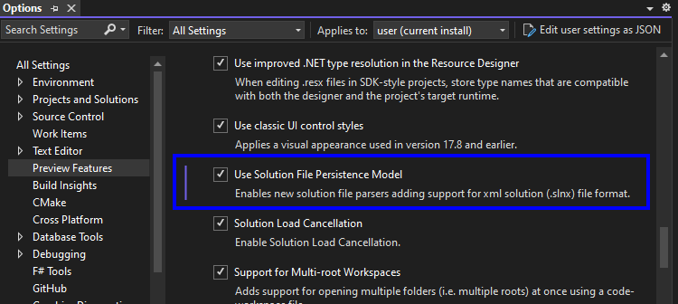
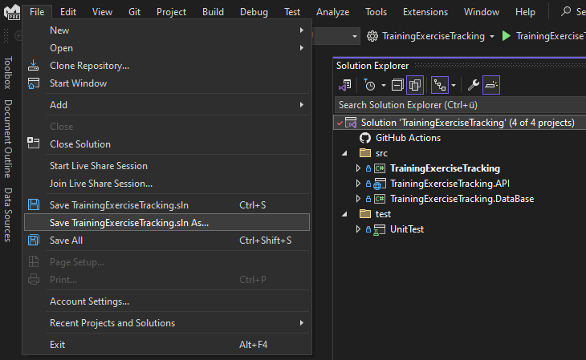
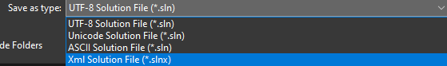

## Intro
There is a very exciting change coming to .NET solution files which i am super excited about.  

## Solution Files Are A Pain!
Currently, solution files are a pain to manage. They use a proprietary format created specifically for VisualStudio.
As an example, let's look at the solution file for [TrainingExerciseTracking](https://github.com/Teddy55Codes/TrainingExerciseTracking). (A project for a coding challenge i recently did.)

```sln
Microsoft Visual Studio Solution File, Format Version 12.00
Project("{FAE04EC0-301F-11D3-BF4B-00C04F79EFBC}") = "TrainingExerciseTracking", "TrainingExerciseTracking\TrainingExerciseTracking.csproj", "{AED0354B-6103-48BD-9B32-CAF16CF1B934}"
EndProject
Project("{FAE04EC0-301F-11D3-BF4B-00C04F79EFBC}") = "TrainingExerciseTracking.API", "TrainingExerciseTracking.API\TrainingExerciseTracking.API.csproj", "{2608CD4F-C223-4C53-B4B1-567C253BF261}"
EndProject
Project("{FAE04EC0-301F-11D3-BF4B-00C04F79EFBC}") = "TrainingExerciseTracking.DataBase", "TrainingExerciseTracking.DataBase\TrainingExerciseTracking.DataBase.csproj", "{25D3F909-CDA3-4F67-AE8B-A8D1E634794A}"
EndProject
Project("{2150E333-8FDC-42A3-9474-1A3956D46DE8}") = "src", "src", "{5241D6E6-137A-4B9A-B375-6A5379455F5A}"
EndProject
Project("{2150E333-8FDC-42A3-9474-1A3956D46DE8}") = "test", "test", "{6A5EAB27-2C85-4AAF-B737-73472934CA85}"
EndProject
Project("{FAE04EC0-301F-11D3-BF4B-00C04F79EFBC}") = "UnitTest", "UnitTest\UnitTest.csproj", "{F276DE7A-66BB-4DFC-96C8-6762DA93B4E5}"
EndProject
Global
	GlobalSection(SolutionConfigurationPlatforms) = preSolution
		Debug|Any CPU = Debug|Any CPU
		Release|Any CPU = Release|Any CPU
	EndGlobalSection
	GlobalSection(ProjectConfigurationPlatforms) = postSolution
		{AED0354B-6103-48BD-9B32-CAF16CF1B934}.Debug|Any CPU.ActiveCfg = Debug|Any CPU
		{AED0354B-6103-48BD-9B32-CAF16CF1B934}.Debug|Any CPU.Build.0 = Debug|Any CPU
		{AED0354B-6103-48BD-9B32-CAF16CF1B934}.Release|Any CPU.ActiveCfg = Release|Any CPU
		{AED0354B-6103-48BD-9B32-CAF16CF1B934}.Release|Any CPU.Build.0 = Release|Any CPU
		{2608CD4F-C223-4C53-B4B1-567C253BF261}.Debug|Any CPU.ActiveCfg = Debug|Any CPU
		{2608CD4F-C223-4C53-B4B1-567C253BF261}.Debug|Any CPU.Build.0 = Debug|Any CPU
		{2608CD4F-C223-4C53-B4B1-567C253BF261}.Release|Any CPU.ActiveCfg = Release|Any CPU
		{2608CD4F-C223-4C53-B4B1-567C253BF261}.Release|Any CPU.Build.0 = Release|Any CPU
		{25D3F909-CDA3-4F67-AE8B-A8D1E634794A}.Debug|Any CPU.ActiveCfg = Debug|Any CPU
		{25D3F909-CDA3-4F67-AE8B-A8D1E634794A}.Debug|Any CPU.Build.0 = Debug|Any CPU
		{25D3F909-CDA3-4F67-AE8B-A8D1E634794A}.Release|Any CPU.ActiveCfg = Release|Any CPU
		{25D3F909-CDA3-4F67-AE8B-A8D1E634794A}.Release|Any CPU.Build.0 = Release|Any CPU
		{F276DE7A-66BB-4DFC-96C8-6762DA93B4E5}.Debug|Any CPU.ActiveCfg = Debug|Any CPU
		{F276DE7A-66BB-4DFC-96C8-6762DA93B4E5}.Debug|Any CPU.Build.0 = Debug|Any CPU
		{F276DE7A-66BB-4DFC-96C8-6762DA93B4E5}.Release|Any CPU.ActiveCfg = Release|Any CPU
		{F276DE7A-66BB-4DFC-96C8-6762DA93B4E5}.Release|Any CPU.Build.0 = Release|Any CPU
	EndGlobalSection
	GlobalSection(NestedProjects) = preSolution
		{AED0354B-6103-48BD-9B32-CAF16CF1B934} = {5241D6E6-137A-4B9A-B375-6A5379455F5A}
		{25D3F909-CDA3-4F67-AE8B-A8D1E634794A} = {5241D6E6-137A-4B9A-B375-6A5379455F5A}
		{2608CD4F-C223-4C53-B4B1-567C253BF261} = {5241D6E6-137A-4B9A-B375-6A5379455F5A}
		{F276DE7A-66BB-4DFC-96C8-6762DA93B4E5} = {6A5EAB27-2C85-4AAF-B737-73472934CA85}
	EndGlobalSection
EndGlobal
```

Imagine creating or editing this file from hand or even resolving a merge conflict in it! It is a truly terrible file format, but this might change soon. 
In VisualStudio 2022 17.10 Preview 3.0, Microsoft silently added a new preview feature "xml solution files".
It can be enabled under: Preview Features > Use Solution File Persistence Model. 



To save an existing solution with the new format, select the solution file. After that select "Save NameOfYourSolution.sln As..." under "File". 



This will open a file dialog with the type option "Xml Solution File (*.slnx)".



This will generate the new xml solution format for your solution. In my case the xml solution looks like this:

```xml
<Solution>
  <Folder Name="/test/">
    <Project Path="UnitTest\UnitTest.csproj" />
  </Folder>
  <Folder Name="/src/">
    <Project Path="TrainingExerciseTracking.API\TrainingExerciseTracking.API.csproj" />
    <Project Path="TrainingExerciseTracking.DataBase\TrainingExerciseTracking.DataBase.csproj" />
    <Project Path="TrainingExerciseTracking\TrainingExerciseTracking.csproj" />
  </Folder>
</Solution>
```

This is revolutionary! At a glance, I can see how my solution is structured! If i wanted, i could even create this by hand!

## Configurations
As you might have spotted there are no run configurations in the example above. 
This is because by default it assumes you want to build every project in Debug and Release mode with platform Any CPU, because for most projects that is what you want.
Let's say we want our tests project to only build in Release mode.

```xml
<Solution>
  <Folder Name="/test/">
    <Project Path="UnitTest\UnitTest.csproj">
      <Configuration Solution="Debug|*" Project="*|*|NoBuild" />
    </Project>
  </Folder>
  <Folder Name="/src/">
    <Project Path="TrainingExerciseTracking.API\TrainingExerciseTracking.API.csproj" />
    <Project Path="TrainingExerciseTracking.DataBase\TrainingExerciseTracking.DataBase.csproj" />
    <Project Path="TrainingExerciseTracking\TrainingExerciseTracking.csproj" />
  </Folder>
</Solution>
```

For this, a Configuration node is added to the test project with the attributes Solution and Project.
The Configuration node can be read as, when the solution is in Debug set this project to NoBuild.

## Availability
This feature is not yet available in MSBuild and [work on the implementation has not started yet](https://github.com/dotnet/msbuild/issues/10012). 
The feature is currently only available in VisualStudio.
