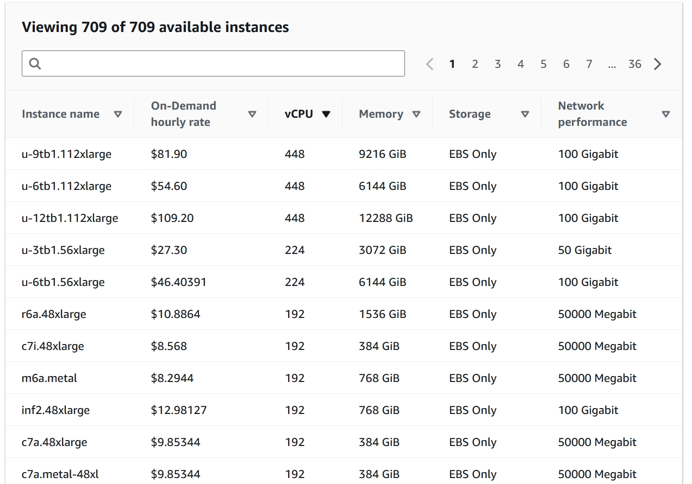

# Parallel Programming In .NET

- [What is Parallel Programming](#what-is-parallel-programming)
- [Task Parallel Library (TPL)](#task-parallel-library-tpl)
  - [Tasks](#tasks)
  - [Parallel Loops](#parallel-loops)
- [PLINQ (Parallel LINQ)](#plinq-parallel-linq)
- [Benchmarks](#benchmarks)
  - [Results](#results)
    - [Accuracy Of Results](#accuracy-of-results)
    - [Parallel Loop Benchmarks](#parallel-loop-benchmarks)
      - [Parallel Loop Set 1 (BCrypt and SHA512)](#parallel-loop-set-1-bcrypt-and-sha512)
      - [Parallel Loop Set 2 (Hashes from System.Security.Cryptography)](#parallel-loop-set-2-hashes-from-systemsecuritycryptography)
      - [Parallel Loop Set 3 (Comparison parallel loops)](#parallel-loop-set-3-comparison-parallel-loops)
    - [PLINQ Benchmarks](#plinq-benchmarks)
      - [PLINQ Set 1 (calculating Primes)](#plinq-set-1-calculating-primes)
      - [PLINQ Set 2 (Hashes from System.Security.Cryptography)](#plinq-set-2-hashes-from-systemsecuritycryptography)
      - [PLINQ Set 3 (cost of switching between LINQ and PLINQ)](#plinq-set-3-cost-of-switching-between-linq-and-plinq)
  - [Benchmarking In The Cloud](#benchmarking-in-the-cloud)
    - [Why Benchmark In The Cloud](#why-benchmark-in-the-cloud)
    - [Running The Benchmarks](#running-the-benchmarks)
    - [Selecting A Cloud Provider](#selecting-a-cloud-provider)
      - [Google Cloud](#google-cloud)
      - [Azure](#azure)
      - [Amazon Web Services](#amazon-web-services)
    - [Cloud Benchmarking Results](#cloud-benchmarking-results)
      - [Cloud Benchmarking Set 1 (Hashes from System.Security.Cryptography)](#cloud-benchmarking-set-1-hashes-from-systemsecuritycryptography)
      - [Cloud Benchmarking Set 2 (BCrypt)](#cloud-benchmarking-set-2-bcrypt)
      - [Cloud Benchmarking Set 3 (Comparing different Loops)](#cloud-benchmarking-set-3-comparing-different-loops)
    - [Cost Of Running The Benchmarks On AWS](#cost-of-running-the-benchmarks-on-aws)
- [Closing Notes](#closing-notes)

## What is Parallel Programming
Today even lower-end machines have multiple CPU threads. By making use of them we can drastically improve the performance of CPU bound tasks.
Writing your code to take advantage of this is called parallel programming. 
In .NET there are multiple tools to help us create parallel code. Most notably the TPL and PLINQ.
There is a very good diagram in the .NET documentation.

\
source: [Parallel programming in .NET: A guide to the documentation](https://learn.microsoft.com/en-us/dotnet/standard/parallel-programming/)

In this diagram you can see that the TPL manages the thread pool and that PLINQ builds on top of the TPL to provide us with a familiar way to interact with the TPL. 

## Task Parallel Library (TPL)
The TPL provides a seamless way to parallelize your workloads and takes care of parallelizing your workload for you.
There are 2 main parts to the TPL tasks and parallel loops.

### Tasks
Tasks are used to run code independent of the main thread without staring a new thread every time.
The TPL uses the concept of a task to abstract the management of threads. It decides when and how many threads to open and distributes the tasks to them.
Creating a new thread in .NET is kinda expensive. To avoid creating new threads too often they are keep around even if they are not currently used. 
This process is facilitated by the thread pool. The thread pool keeps track of all created threads and has a queue of waiting threads. 
The TPL can distribute its workload across these waiting threads and if required, more threads can be added to the thread pool. 

As a sidenote to decide how many and how fast to create new threads the [Hill Climbing algorithm](https://en.wikipedia.org/wiki/Hill_climbing) is used. 
I found [this article](https://mattwarren.org/2017/04/13/The-CLR-Thread-Pool-Thread-Injection-Algorithm/) on the subject very interesting. 

### Parallel Loops
There are 4 parallel loops `Parallel.For`, `Parallel.ForEach`, `Parallel.ForAsync` and `Parallel.ForEachAsync`. 
They take in a lambda and execute it in parallel by distributing the workload on the thread pool.

For:
```csharp
// Sequential version
for (int i = 0; i < sourceCollection.Count; i++)
{
    Process(sourceCollection[i]);
}

// Parallel equivalent
Parallel.For(0, sourceCollection.Count, i => Process(sourceCollection[i]));
```

ForEach:
```csharp
// Sequential version
foreach (var item in sourceCollection)
{
    Process(item);
}

// Parallel equivalent
Parallel.ForEach(sourceCollection, item => Process(item));
```

As you can see, they are quite straightforward to use. 
Although there are some consideration you have to make when using parallel loops. 
If your application is very short-lived it may considerably slow down you application.
Because if your application is otherwise single-threaded, this will cause the creation of all the threads necessary to run your workload in parallel. 
This is because the thread pool is still empty.
If your workload is very short, by ether having very little iterations or only very little work per iteration, the management of parallelization and invocation of the provided delegate might out way the performance gain parallelization provides.
Also, the performance gain is very much dependent on the CPU your program is running on. The more threads and cores you have the greater the performance gain.

## PLINQ (Parallel LINQ)
PLINQ builds on top of the TPL. It provides a way to parallelize workloads in a way that is easy to use.
If you have an existing LINQ statement that does not need to run sequentially you can simply add [AsParallel](https://learn.microsoft.com/en-us/dotnet/api/system.linq.parallelenumerable.asparallel) and your LINQ turns into a PLINQ.
You can even use PLINQ when your result needs to be ordered, but your workload doesn't actually need to run sequentially. This can be done via [AsOrdered](https://learn.microsoft.com/en-us/dotnet/api/system.linq.parallelenumerable.asordered).

What enables PLINQ to be used almost everywhere is the ability to switch between PLINQ and LINQ in the same statement.
```csharp
Enumerable.Range(0, 100)
    .AsParallel()
    .Where(num => num > 10)
    .AsSequential()
    .Select(num => Math.Pow(num, 2))
    .AsParallel()
    .AsOrdered()
    .Where(num => num % 2 == 0);
```

I was not able to check the overhead of switch between LINQ and PLINQ. see: [PLINQ Set 3 (cost of switching between LINQ and PLINQ)](#plinq-set-3-cost-of-switching-between-linq-and-plinq)

## Benchmarks
So when should you use parallel loops and PLINQ? What is the threshold at which an operation becomes expensive enough to exceed the overhead?
To test this i used among others things, [BCrypt.Net - Next](https://github.com/BcryptNet/bcrypt.net) and the built-in [System.Security.Cryptography](https://github.com/dotnet/runtime/tree/main/src/libraries/System.Security.Cryptography) library to calculate hashes. 
This is a CPU bound task which should have predictable execution times even across .NET versions. 
At least that is what i taught at first. It turns out that there is a significant difference between .NET versions. 
The difference in speed across version for BCrypt is about 10% and the build in cryptography library run about 3x faster in [.NET 8](../../Resources/24.04/Benchmarks/ParallelLoops/Set1_BCryptAndSHA512/result/benchmark_.NET_8.0_SHA512.png) then in [.NET Framework 4.8.1](../../Resources/24.04/Benchmarks/ParallelLoops/Set1_BCryptAndSHA512/result/benchmark_.NET_Framework_4.8.1_SHA512.png). 

> If you run the benchmarks yourself and want to generate the fancy graphs for your results you will need to [install R](https://cran.r-project.org/mirrors.html).
> If a benchmark set has an R script is stored in the top level of its "result" directory.
> 
> Even though i didn't use the generated R script the `RPlotExporter` attribute is still set. 
> This is because the nicely formatted csv file (the one ending in -measurements) is only generated if this attribute is set.
> If you want to run the benchmarks without having R installed you can keep the `RPlotExporter` attribute it shows an error at the end, but everything else runs as normal.

### Results
During benchmarking, it was very noticeable if a method with parallelization was running or not. 
The extra performance you get with parallelization is obviously not free and it shows. 

While execution parallel workload:


While execution non-parallel workload:


#### Accuracy Of Results
Regarding the accuracy of the results, keep in mind that i ran these while doing other work on my Laptop. 
I also ran them during my lunch break and while the Laptop was not charging, so even battery management probably had some impact. 
This fluctuation in availability of system resources probably had some effect on the benchmark results. 
Although i think that the results are not invalidated by that.

#### Parallel Loop Benchmarks

##### Parallel Loop Set 1 (BCrypt and SHA512)
On my first set of benchmarks i vastly overestimated the overhead of parallel loops. 
Almost all operations i ran where expensive enough for parallel loops to be faster.
But there are still some noteworthy things in this benchmark set. 

The benchmarks for this set are split into two parts. 
one part is calculating SHA512 hashes. The other calculating BCrypt hashes.
Before i ran the benchmarks i thought that the SHA512 hash was maybe too cheap of an operation to be faster with parallel for loops.
I was wrong though, after only 100 iterations the parallel loop was faster. 
I also didn't expect the [small loop body optimization](https://learn.microsoft.com/en-us/dotnet/standard/parallel-programming/how-to-speed-up-small-loop-bodies) to make basically no difference. 


The BCrypt benchmarks where a flop. Even on the shortest BCrypt hash operation the parallel for loop was faster.
There is still something we can pull out of this tough. We can see by how much parallel loops where faster. 
because by accident i created an ok benchmark to measure the performance gain on operation that favor parallel loops.

Let's look at a subset of the results.

| .NET 8                                 | NativeAOT 8                            | .NET Framework 4.8.1                   |  Cost  | Iterations          |
|----------------------------------------|----------------------------------------|----------------------------------------|:------:|---------------------|
| 5,673.441 / 1,778.922 μs =<br/>3.189x  | 6,140.576 / 1,831.172 μs =<br/>3.353x  | 6,765.380 / 2,235.149 μs =<br/>3.027x  |   4    | 5                   |
| 116.911 / 24.756 ms =<br/>4.723x       | 105.897 / 23.714 ms =<br/>4.465x       | 122.644 / 26.516 ms =<br/>4.625x       |   4    | 100                 |
| 11,745.192 / 2,137.591 ms =<br/>5.495x | 11,539.251 / 1,975.532 ms =<br/>4.957x | 13,423.464 / 2,079.574 ms =<br/>5.095x |   4    | 10000               |
| 419.390 / 111.535 ms =<br/>3.76x       | 338.278 / 104.661 ms =<br/>3.232x      | 408.586 / 136.293 ms =<br/>2.998x      |   10   | 5                   |
| 666.642 / 170.726 ms =<br/>3.905x      | 701.939 / 161.269 ms =<br/>4.353x      | 811.864 / 190.594 ms =<br/>4.26x       |   10   | 10                  |
| 6,949.813 / 1,443.584 ms =<br/>4.814x  | 7,104.026 / 1,312.537 ms =<br/>5.412x  | 8,338.699 / 1,645.699 ms =<br/>5.067x  |   10   | 100                 |
|                                        |                                        |                                        |        |                     |
| 4.314x                                 | 4.295x                                 | 4.179x                                 | 4.263x | Average improvement |
 
We can see that on my CPU (Intel i7-9750H 6 Cores 12 Threads) parallel loops had an on average more than 4x performance improvement.  

Here are 2 other graphs i crafted in R, they show the performance improvements of using parallel loops.


If we split the graphs by Iterations we can see something unexpected. The parallel loop optimized for small loop bodies is actually considerably slower on the least expensive hash. 
So it does the exact opposite of what it is supposed to do. 
I think this could be because all hash operations i had in this benchmark are way too expensive to actually be candidates for this optimization. 


##### Parallel Loop Set 2 (Hashes from System.Security.Cryptography)
In this benchmark i ran a few different hashing algorithms from System.Security.Cryptography over 100,000 byte arrays, all containing the same lorem ipsum paragraph.  


One thing i noticed is that SHA512 performed better than SHA256 even though SHA256 is less computationally expensive. 
After looking this up i found out that SHA512 [performs better on 64-bit hardware](https://debugpointer.com/security/sha256-vs-sha512).

##### Parallel Loop Set 3 (Comparison parallel loops)
In this benchmark i ran the SHA512 algorithm over the string "Hello world" a bunch of times.
I wanted to show which loop is the fastest at which iteration length.


We can see that in this case parallel loops started being faster at around 50 iterations. 
Again, even though this operation is very cheap, the parallel loop that is optimized for small operations didn't show any difference in performance compared to the other parallel loops.
I honestly don't know why this is recommended in the docs. Ether no one ever actually benchmarked this before or i am missing something major.

#### PLINQ Benchmarks
A made quite a big blunder on these benchmarks. When i first created them i forgot to add a `.ToList()` at the end of the PLINQ and LINQ statements. 
This caused them to not actually be evaluated because LINQ and PLINQ statements are evaluated lazily. 
I only noticed that after running all 3 benchmark sets. This wasted around 2 hours of benchmarking time. 

##### PLINQ Set 1 (calculating Primes)
In this benchmark i used LINQ, PLINQ and ordered PLINQ to calculate primes up to 1,000, 10,000, 100,000 and 1 million.


Checking whether one number is a prime is an incredibly cheap operation. So i ran this benchmark with up to 1 million iterations.
It is interesting to see that .NET Framework needed considerably more iterations for PLINQ to become faster than LINQ. 
In .NET 8 PLINQ is about 50% faster than LINQ at calculating primes up to 10,000. 
While in .NET Framework PLINQ is at that point still over 50% slower than LINQ.

##### PLINQ Set 2 (Hashes from System.Security.Cryptography)
This is the same benchmark as [set 2 for parallel loops](#parallel-loop-set-2-hashes-from-systemsecuritycryptography) just for PLINQ.


As expected PLINQ and LINQ are a bit slower than Parallel For and For, but that makes sense considering that LINQ does a lot more than a regular for loop.
What's interesting about it for me is that it shows that. LINQ gets way too much bad wrap when it comes to performance. 
LINQ itself is not that much slower than the equivalent for loop. 
This is maybe a bit bold of a statement considering how little this benchmark covers, but i was under the belief that LINQ would take closer to 1.5 times as long as a for loop.
Also, your manual for loop will probably not get much faster in future .NET versions while LINQ receives constant performance improvements which most of the time you can harvest by changing 1 character in your project file.

##### PLINQ Set 3 (cost of switching between LINQ and PLINQ)
Here i created a small benchmark to test the cost of switching between LINQ and PLINQ.
The benchmark consists of 2 methods:

```csharp
[Benchmark]
public void Switching() => Enumerable.Range(0, EnumerableLength).AsParallel().AsSequential().Select(num => Math.Pow(num, 2)).ToList();
    

[Benchmark]
public void NoSwitching() => Enumerable.Range(0, EnumerableLength).Select(num => Math.Pow(num, 2)).ToList();
```

Let's look at a subset of the results:

| EnumerableLength |                                  Mean Cost | StdDev                      | Runtime              |
|------------------|-------------------------------------------:|-----------------------------|----------------------|
| 10,000           |              328.5 μs - 301.8 μs = 26.7 μs | 5.75 μs & 6.38 μs           | .NET 8               |
| 100,000          |         4,018.5 μs - 3,460.8 μs = 557.7 μs | 818.00 μs & 215.95 μs       | .NET 8               |
| 1,000,000        |     32,809.7 μs - 31,759.2 μs = 1,050.5 μs | 1,273.14 μs & 1,032.50 μs   | .NET 8               |
| 10,000,000       | 328,634.5 μs - 343,483.8 μs = -14,849.3 μs | 3,636.02 μs & 5,591.86 μs   | .NET 8               |
| 10,000           |              611.1 μs - 613.8 μs = -2.7 μs | 28.02 μs & 26.43 μs         | .NET Framework 4.8.1 |
| 100,000          |         6,712.1 μs - 6,266.5 μs = 445.6 μs | 810.30 μs & 318.47 μs       | .NET Framework 4.8.1 |
| 1,000,000        |       65,161.0 μs - 60,081.0 μs = 5,080 μs | 6,875.30 μs & 2,808.43 μs   | .NET Framework 4.8.1 |
| 10,000,000       | 616,504.6 μs	- 629,539.7 μs = -13,035.1 μs | 10,487.10 μs & 11,672.68 μs | .NET Framework 4.8.1 |

The "Mean Cost" is Switching - NoSwitching.
The "StdDev" is Switching & NoSwitching.

The results are less than clear. The mean cost does not grow with the enumerable length, it doesn't stay the same and it also only partially correlate with the standard deviation.

Maybe the switching gets optimized away? I checked the generated assembly for both methods, but i am still not completely sure if the switching was optimized away. 
The output is different but i don't know if the extra instructions are just the extra methods that where inlined. 
* The [NoSwitching assembly](../../Resources/24.04/Benchmarks/PLINQ/Set3_Switching/result/JITOutputTest/NoSwitching.asm) has 7 inlines with PGO data and 10 single block inlines. 
* The [Switching assembly](../../Resources/24.04/Benchmarks/PLINQ/Set3_Switching/result/JITOutputTest/Switching.asm) has 10 inlines with PGO data and 23 single block inlines.

So it makes sense that the assembly of Switching is larger.
I opened the two assembly sections in diff and the only major difference i saw was this extra section in the assembly for Switching:
```asm
G_M000_IG03:                ;; offset=0x0064
       mov      rcx, 0x7FFC4F9975C0
       call     CORINFO_HELP_NEWSFAST
       mov      rbx, rax
       mov      rcx, 0x7FFC4F9980D8
       call     CORINFO_HELP_NEWSFAST
       mov      rdi, rax
       xor      ecx, ecx
       mov      qword ptr [rdi+0x20], rcx
       mov      rcx, 0x7FFC4F998238
       call     CORINFO_HELP_NEWSFAST
       mov      byte  ptr [rax+0x08], 0
       lea      rcx, bword ptr [rdi+0x18]
       mov      rdx, rax
       call     CORINFO_HELP_ASSIGN_REF
       lea      rbp, bword ptr [rbx+0x08]
       xor      rcx, rcx
       mov      gword ptr [rbp], rcx
       lea      rcx, bword ptr [rbp+0x08]
       mov      rdx, rdi
       call     CORINFO_HELP_CHECKED_ASSIGN_REF
       mov      dword ptr [rbp+0x10], -1
       mov      byte  ptr [rbp+0x14], 0
       xor      ecx, ecx
       mov      dword ptr [rbp+0x18], ecx
       mov      byte  ptr [rbp+0x1C], 0
```
But i didn't find anything related to threading in it.
I checked what the different calls call, but they are very generic.

* [CORINFO_HELP_NEWSFAST](https://github.com/dotnet/runtime/blob/0c64e66b497740e4477ad27bb532e564afb4c186/src/coreclr/inc/corinfo.h#L408):
  allocator for small, non-finalizer, non-array object
* [CORINFO_HELP_ASSIGN_REF](https://github.com/dotnet/runtime/blob/0c64e66b497740e4477ad27bb532e564afb4c186/src/coreclr/inc/corinfo.h#L494):
  universal helpers with F_CALL_CONV calling convention
* [CORINFO_HELP_CHECKED_ASSIGN_REF](https://github.com/dotnet/runtime/blob/0c64e66b497740e4477ad27bb532e564afb4c186/src/coreclr/inc/corinfo.h#L495):
  No comment but is probably similar to CORINFO_HELP_ASSIGN_REF.

In the end it looks to me like it is optimized away, but i can't confirm that. This is simply beyond me. 

### Benchmarking In The Cloud
This section describes my journey of benchmarking in the cloud.

#### Why Benchmark In The Cloud
There are a few reasons why i wanted to benchmark in the cloud. 
The first is that benchmarks done on my work machine always have an extra amount of error because of varying availability of system resources as mentioned [before](#accuracy-of-results).
In a VM in the cloud this would not be an issue because the VM could exclusively run a benchmark.
The other and more important reason is that these cloud provider offer VMs with hundreds of vCPUs and i would really like to see how .NET copes with having 100+ threads available.
You may ask, but are these not extremely expensive? Yes, but if they only run for a short time they are quite affordable.

#### Running The Benchmarks
To easily run my benchmarks remotely i created [this project](https://github.com/Teddy55Codes/ContainerizedDotnetBenchmarks).
It contains a server and a client. The client can be deployed as a docker container and phones benchmark progress and results home to the server.
The server displays the status of each client on the console and saves the received benchmark results.

#### Selecting A Cloud Provider
I needed to find a cloud provider that offers VMs with a lot of vCPUs at an affordable price and as i later found out, they also need to give me enough quota to use them.

##### Google Cloud
This is the first one i tried. I choose this provider first because they have VMs with ridiculous vCPU counts. 
As an example the C3D instance type is available with 360 vCPUs


Unfortunately, I ran into a problem very early on. New accounts are only allowed to launch VMs with a maximum of 8 vCPUs which is less than my laptop at work.

##### Azure
Azure only offers VMs with a maximum of 64 vCPUs, as far as i could tell.


##### Amazon Web Services
Amazon Web Services (AWS) has even beefier VMs available than Google Cloud. Here the highest vCPU count is 448, but they are a bit too expensive for my apprentice wage. 



On AWS i was able to launch VMs with up to 32 vCPUs without manually requesting more quota.


The default quota is only 5, but it scales up automatically when you start using VMs. 
They scaled up so fast that i didn't even notice that the default quota was 5 until i checking in the overview of all my quotas in the dashboard.
At 32, the quota no longer automatically increased for me. So at this point i started realizing that cloud providers will probably not give there 100+ vCPU VMs to just anyone.
But i didn't give up there. I could still manually request a quota increases. First i requested a quota of 64 vCPUs. Which got accepted in only 30 minutes!! \(´▽`)/
I didn't stop there tough. After a bit of benchmarking with instances up to 64 vCPUs i put in another request to increase my EC2 quota. This time i requested 192 vCPUs. 
This request took a few days and i started to think that a 192 vCPU quota is probably a bit too large for such a new account. 
I did not have an AWS before so i my account was still very new. Nevertheless, after 3 days i got the confirmation that my quota increase request was accepted!! 
I can now run VM on AWS in the EU (Stockholm) region with 192 vCPUs!!! 
honestly after finding out how low the default quotas on AWS (5 vCPUs) and on Google Cloud (8 vCPUs) are i didn't expect to get a quota of 192 accepted.

I only had one issue with AWS. When you create your AWS EC2 instance you can choose a [AMI (Amazon Machine Image)](https://docs.aws.amazon.com/AWSEC2/latest/UserGuide/AMIs.html). 
Initially i tried a Debian AMI but for some reason networking didn't work. In the dashboard the vm showed up as having passed all health checks, but when i tried to connect to it via ssh it did not respond. 
I tried a few time until i gave up and choose an Ubuntu AMI. The benchmarks still show Debian because the default .NET 8.0 docker image is based on it.

#### Cloud Benchmarking Results
At the end i choose AWS to do my benchmarking because they gave me the most compute to work with. 

For these benchmarks I removed .NET Framework 4.8.1 and NativeAOT 8.0 as targets. I removed .NET Framework 4.8.1 because i one didn't want to deal with Windows VMs and i also didn't want to pay more for the same amount of compute.
NativeAOT 8.0 i mainly removed to save benchmarking time because longer running benchmarks cost more money.

##### Cloud Benchmarking Set 1 (Hashes from System.Security.Cryptography)
So the first set i ran was a simplified version of the [hashing benchmarks with parallel loops](#parallel-loop-set-2-hashes-from-systemsecuritycryptography) benchmark. 
I ran this benchmark with 16, 32 and 64 vCPUs on the [c5a instance](https://aws.amazon.com/ec2/instance-types/c5/) type. This instance type uses the [AMD EPYC 7R32 CPU](https://www.cpubenchmark.net/cpu.php?cpu=AMD+EPYC+7R32) which has 2 threads per physical core.
I quickly ran into an issue. These hashing operations where too cheap. When multithreading works properly we expect that the computation time should be close to half when we double the core count. 
For this benchmark that was not the case.


In this diagram we can see that single threaded time stays about the same which is what we expect and confirms that the VMs have the same single thread performance.
But the multithreaded performance is not what we expect we see only a slight improvement for each doubling of CPU cores. 
From 16 vCPUs to 32 vCPUs we see an improvement of only 11% and from 32 vCPUs to 64 vCPUs an improvement of 10%. 
While we expect to see an improvement of around 100%. My immediate suspicion was that the managing of multithreaded execution was too expensive for this small of operations.
Even though the test with optimization for small operations was slower again, but by now i think this optimization just doesn't work as well as thought.
This brings us to the next set.

##### Cloud Benchmarking Set 2 (BCrypt)
This set is a modified version of the [parallel loops set 1](#parallel-loop-set-1-bcrypt-and-sha512). This benchmark was also done with c5a instances.
I removed the SHA512 part and only tested at 300 iterations with the BCrypt cost at 4, 6, 8 and 10. These operations are much more expensive. 
So i can test my previous suspicions.


The results seem to prove my suspicions right. This time, as the CPU core count doubles, the processing time halves. 
But i accidentally found something more interesting. Starting with the 64 vCPU VM, optimization for small operations did make a difference, and a big one. 
The parallel loop optimization for small operations is about 40% on 64 vCPUs and 25% on 96 vCPUs faster than the regular parallel loop.

| Speed increase for Optimized | vCPU Count | BCrypt Cost |
|-----------------------------:|------------|-------------|
|                       35.67% | 64         | 4           |
|                       41.02% | 64         | 6           |
|                       45.49% | 64         | 8           |
|                       46.35% | 64         | 10          |
|                       28.97% | 96         | 4           |
|                       21.53% | 96         | 6           |
|                       14.25% | 96         | 8           |
|                       41.64% | 96         | 10          |

The problem is that it behaves exactly opposite to how it should. it has a higher performance gain with more expensive operations.
What's also strange is that this improvement is very sudden. With 32 vCPUs th average improvement is only 1.64% which is well in the margins of error. 
I haven't found an explanation for this. My best guess is that distributing the workload becomes more expensive with a larger thread pool.
(In the next set of benchmarks, I found that this was not the reason for this phenomenon.)

##### Cloud Benchmarking Set 3 (Comparing different Loops)
This is the largest set i benchmarked on the cloud. It is also the only one i ran on a 192 vCPU VM. I ran this benchmark with vCPU counts 2, 4, 8 , 16, 32, 64, 96 and 192.
For This benchmark i used [c7i instances](https://aws.amazon.com/ec2/instance-types/c7i/) which use the [Intel Xeon Platinum 8488C CPU](https://www.cpubenchmark.net/cpu.php?cpu=Intel+Xeon+Platinum+8488C&id=5621&cpuCount=2). 
This CPU has 48 cores with 2 threads per core. Yes, this is only 96 threads, but why can we run this instance with 192 threads then? This is possible because this CPU is a Dual-CPU. That means 2 of them can be used in a single system.

This benchmark runs the [Bcrypt algorithm](https://en.wikipedia.org/wiki/Bcrypt) with different costs over a string array of 300 lorem ipsum paragraphs. 
It does this for a bunch of different types of loops:
* for
* foreach
* Parallel.For
* Parallel.ForEach
* Parallel optimized for small bodies. (using Parallel.ForEach) 
* LINQ
* PLINQ

I will only show one of the diagrams i created for this benchmark, because i think this one is the only one that is not misleading in some way. 
You are free to check out the other diagrams in the [resources](../../Resources/24.04/CloudBenchmarking/Benchmarks/Set3_BCrypt_Final/result) though.

For a quick rundown why the other ones are misleading:
* [benchmark_BCrypt_vCPU_Difference_Numeric_vCPU_Count.png](../../Resources/24.04/CloudBenchmarking/Benchmarks/Set3_BCrypt_Final/result/benchmark_BCrypt_vCPU_Difference_Numeric_vCPU_Count.png)\
  In this one it looks like there is a fall off in the amount gained by doubling thread count. 
  This is because the y-axis is log 10 while the x-axis is linear.
* [benchmark_BCrypt_vCPU_Difference.png](../../Resources/24.04/CloudBenchmarking/Benchmarks/Set3_BCrypt_Final/result/benchmark_BCrypt_vCPU_Difference.png)\
  In this one the vCPU count is not used as a numeric and dus they are distributed evenly across the x-axis. 
  This is misleading because the vCPU increases are not 2x every time. From 64 to 96 is only a 1.5x increase.
  I need to admit, i am guilty of creating diagrams with uneven x-axis increases before. 
  There are quite a few of these in previous benchmarks, but i don't have time to go back in fix this. 
  This month's topic has already taken up far too much time.

Ok, let's look at the one i concocted which to be fair looks weird, but i think represents the results the best.
In this diagram the y-axis is log 10 as with most of the diagrams. The x-axis however is log 2.


Here we can again see that the parallel loop optimized for small operations is faster with 64 and 96 vCPUs. 
What's interesting is that this performance improvement goes away when running with 192 vCPUs.

What was also surprising to me is that PLINQ ordered and un-ordered where faster, on almost all configurations, than parallel loops.
It also caught my eye that starting with 64 threads, PLINQ and the parallel loop optimized for small operations have similar performance.

When we look at the first graph (the one for Bcrypt cost 4). We can see how the returns for more threads start to diminish. 
Running with 192 vs. 96 threads only gains a speed-up of about 10% if we remove the outlier (parallel loop optimized for small operations).

But what probably was the biggest surprise is that with 192 threads all methods of looping preformed similarly. 
I feel like it could have something todo with running on 2 CPUs or that with all other configurations the VM had to share its CPU resources with other VMs.
However, i found it cool to see that even when running with 192 threads across 2 CPUs, performance gains stayed stable for more expensive workload (all with cost >= 6).

#### Cost Of Running The Benchmarks On AWS
Running VMs on AWS is obviously not free. So how much did the hole thing cost me?


The total cost comes to `20.60$`. About `8$` of that is just for the one time i ran the 192 vCPU instance. 
This instance has an hourly costs of a whopping `9$`.

## Closing Notes
This is the largest post i have made so far. Something i did expect is to learn a bit of R. I used it to create the graphics. Honestly, i never expected to program anything in R. 
But R was perfect for this. I sometimes needed to tweak benchmarks, if i had to redraw the graphics every time i probably would have given up on making them.

I found it impressive how well the .NET TPL performed with very high amounts of threads. 
The Intel Xeon Platinum 8488C Dual-CPU setup i used in the last benchmark is currently the [most performant Intel server CPU setup](https://www.cpubenchmark.net/multi_cpu.html). 
It is honestly still a bit ridiculous to me that i was allowed to use something like that. :D

Thanks for reading this post. It got a bit long. ^^