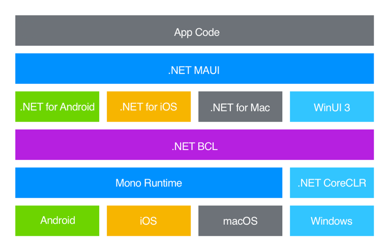

# The State Of Cross-platform .NET And How Mono Is Still Relevant

- [Intro](#intro)
- [Terms](#terms)
- [What Is Mono](#what-is-mono)
  - [How Mono Came To Be](#how-mono-came-to-be)
  - [Development Timeline](#development-timeline)
  - [The State Of Mono](#the-state-of-mono)
- [Mono AOT vs. NativeAOT](#mono-aot-vs-nativeaot)
- [Mono In MAUI](#mono-in-maui)
  - [MAUI On Android](#maui-on-android)
  - [MAUI On IOS And Mac Catalyst](#maui-on-ios-and-mac-catalyst)
- [Mono In Blazor](#mono-in-blazor)
- [Closing Notes](#closing-notes)

## Intro
Today it is easy to think that the .NET CoreCLR runs everywhere and has replaced Mono, but if that where true why does the architecture of MAUI look like this?

As we can see here the Mono runtime is used for all platforms besides Windows.
So let's take a better look at the state of cross platform .NET and how the Mono and the CoreCLR runtimes differ in there cross-platform support.

## Terms
To differentiate between "regular" .NET and Mono i will call "regular" .NET **MS .NET** when it is not clear which is being referenced.
(Yes both are owned by Microsoft but Mono was only acquired.)

When i use the term MS .NET i'm referring to the combination of the [.NET runtime](https://github.com/dotnet/runtime), the [Roslyn compiler](https://github.com/dotnet/roslyn) and the [MSBuild build tool](https://github.com/dotnet/msbuild). 

## What Is Mono
Mono is an opensource implementation of .NET Framework which follows the [ECMA-335 (Common Language Infrastructure)](https://ecma-international.org/publications-and-standards/standards/ecma-335/) standard.
The initial focus of Mono was to create a working implementation of .NET Framework for linux. Over the years it added support for [additional platforms](https://www.mono-project.com/docs/about-mono/supported-platforms/).

### How Mono Came To Be
The Mono project was created by [Miguel de Icaza](https://en.wikipedia.org/wiki/Miguel_de_Icaza) at [Ximian](https://en.wikipedia.org/wiki/Ximian) in 2001. A company developing applications for [GNOME](https://www.gnome.org/).
Miguel de Icaza is best known for starting the GNOME project together with Federico Mena.
Ximian was acquired by [Novell](https://en.wikipedia.org/wiki/Novell) in 2003 which was then acquired by [The Attachmate Group](https://en.wikipedia.org/wiki/The_Attachmate_Group) in 2011. 
Shortly after the acquisition of Novell The Attachmate Group laid off all US staff working on Mono including Miguel de Icaza. 
After that Miguel de Icaza and [Nat Friedman](https://en.wikipedia.org/wiki/Nat_Friedman) (the founders of Ximian) founded [Xamarin](https://en.wikipedia.org/wiki/Xamarin). Which got acquired by Microsoft in 2016

### Development Timeline
Some highlights in the development of Mono.

* **2001** Project Start 
* **2004** [Mono 1.0](https://www.mono-project.com/docs/about-mono/releases/1.0.0/) is released with C# 1.0 support.
* **2008** [Mono 2.0](https://www.mono-project.com/docs/about-mono/releases/2.0.0/) is released with C# 3.0 support.
* **2009** [Mono 2.6](https://www.mono-project.com/docs/about-mono/releases/2.6.0/) is released with support for compiling to LLVM. 
* **2010** [Mono 2.8](https://www.mono-project.com/docs/about-mono/releases/2.8.0/) is released with C# 4.0 and [Dynamic Language Runtime](https://github.com/IronLanguages/dlr) support. 
* **2012** [Mono 3.0](https://www.mono-project.com/docs/about-mono/releases/3.0.0/) is released with C# 5.0 support.
* **2015** [Mono 4.0](https://www.mono-project.com/docs/about-mono/releases/4.0.0/) is released with C# 6.0 support. Mono starts to integrate .NET Core code.
* **2017** [Mono 5.0](https://www.mono-project.com/docs/about-mono/releases/5.0.0/) is released with C# 7.0 support. Mono now contains part of the [Roslyn compiler](https://github.com/dotnet/roslyn) to support C# 7.0. 
* **2017** [Mono 5.2](https://www.mono-project.com/docs/about-mono/releases/5.2.0/) is released with support for .NET Standard 2.0 assemblies.
* **2018** [Mono 5.8](https://www.mono-project.com/docs/about-mono/releases/5.8.0/) is released with support for compiling to WebAssembly.
* **2018** [Mono 5.12](https://www.mono-project.com/docs/about-mono/releases/5.12.0/) is released. Mono now also ships the Roslyn VB.NET compiler.
* **2019** [Mono 6](https://www.mono-project.com/docs/about-mono/releases/6.0.0/) is released. It's C# compiler now defaults to C# 8.0 RC. The Mono interpreter is feature complete and stable now.
* **2019** [Mono 6.4](https://www.mono-project.com/docs/about-mono/releases/6.4.0/) is released with support for C# 8.0 and .NET Standard 2.1.

For a more complete list see [Mono version history on Wikipedia](https://en.wikipedia.org/wiki/Mono_(software)#Version_history_2) and [Mono releases](https://www.mono-project.com/docs/about-mono/releases/).

### The State Of Mono
One thing you might notice is the [Mono development timeline](#development-timeline) is that it ends in 2019.
This is because in the last 5 years there has not been any major development in Mono. This is reflected in the contribution graph for the [Mono GitHub repository](https://github.com/mono/mono). 

I added the release dates of .NET Core 1.0 and .NET 5.0. 
We can see that as .NET 5 was developed and released Mono development stagnated significantly.

So if Mono has not seen any significant development in 5 years why is it still used?
There are a few reasons: 
* Mono has an interpreter which MS .NET does not have. 
* Mono's AOT compiler
* Xamarin.Forms
* Different supported platforms

Although it is clear that Mono as a standalone project is basically dead.
Mono is still relevant via its components that have been integrated into MS .NET.

I think Mono gave the .NET ecosystem a huge boost. 
It brought a lot of innovations to the table that we still rely on.

## Mono AOT vs. NativeAOT
There are 2 main technologies for compiling .NET ahead-of-time, the Mono AOT compiler and the new NativeAOT compiler from MS .NET.
They both approach the problem of AOT compiling .NET in a different way. 
To understand why there are even multiple ways to approach the problem of compiling .NET AOT, we first need to understand why compiling .NET AOT is impossible. 
So what do i mean by that? .NET is a very powerful framework that was built from the ground up to be JIT compiled.

Having your code be created and linked at runtime opens a lot of possibilities. 
If your code is only compiled and linked as your program already runs, what stops you from just creating new code, compiling it and linking it to your program right then? 
Nothing, in .NET it is possible to generate additional CIL and run it at runtime. 
This is very cool when you run your program with a JIT compiler, but impossible for AOT compilation. This is because in AOT compilation your program needs to be linked before running. 
As you can imagine, this is a bit difficult if your code doesn't even exist yet.

This means if you want to compile .NET AOT you will need to refrain from using such features. Not using them in your own code is most of the time easy. 
Most user code does not directly use complex forms of reflection. Where things get tricky is in your dependencies because they also need to be AOT compatible.

Well this is where we come to the main difference between the Mono AOT and the new Native AOT compiler.
When running your app with Mono AOT. The AOT compiler tries to compile as much of your code AOT as possible. 
Everything that is not compatible runs interpreted. The NativeAOT compiler does not do that. 
It compiles all your code AOT, running the risk that your program crashes, when it tries to execute incompatible code.

To recap, the two approaches are:
* Mono AOT\
  Compile as much as possible AOT and run the rest interpret. 
* NativeAOT\
  Compile everything AOT with the risk of crashes.

## Mono In MAUI
Let's go back to the original question of why MAUI uses Mono. 

### MAUI On Android
MAUIs support for Android builds on top of [Xamarin.Forms](https://github.com/xamarin/Xamarin.Forms). 
Support for Xamarin.Forms has ended on May 1, 2024, but it lives on in its successors. 
Android support in MAUI, AvaloniaUI and the UNO Platform is based on Xamarin.Forms. 
Although in need to admit that it was a bit off a fuck you move from microsoft to stop supporting Xamarin.Farms already.
MAUI is in my opinion not yet stable enough to replace it. 

Since MAUI's Android support is based on Xamarin.Forms, which is a Mono project, Mono is used for Android.

### MAUI On IOS And Mac Catalyst
IOS and Mac Catalyst on ARM64 explicitly disallow the usage of dynamically generated code. 
This means JIT compilation is not possible on these platforms. 
As mentioned [before](#mono-aot-vs-nativeaot) not all .NET language features are available when AOT compiling. 
Using the Mono AOT compiler allows these features to be available anyway while still offering an AOT only mode.
Looking at the facts it makes a lot of sense to use Mono here. 
Mono might be the default, but you can still use NativeAOT for these platforms. NativeAOT support for these platforms has been [in development since .NET 8](https://github.com/dotnet/runtime/issues/80905). 
It is currently an opt-in feature, but will most likely become the default moving forward.

## Mono In Blazor
Blazor webassembly projects use Mono's [Jiterpreter](https://github.com/dotnet/runtime/blob/main/docs/design/mono/jiterpreter.md) to run CIL in WASM.
The Jiterpreter is a JIT compiler for the Mono interpreter component of the .NET WASM runtime.
It is used to make wasm packets smaller, which reduces website load times.

## Closing Notes
I had to keep this post a bit shorter to catch back up with my monthly schedule. 
I hope the post was still interesting to read. It was certainty interesting to research and find out where Mono is still used and why.

I hope you enjoyed this shorter post and as always thanks for reading :) 