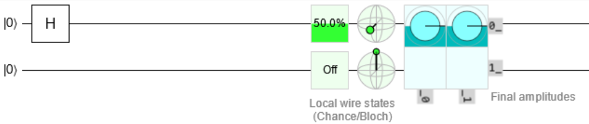
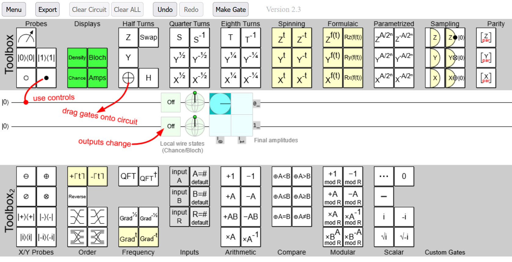
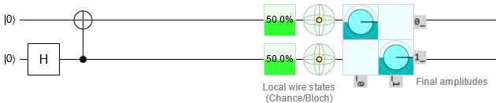
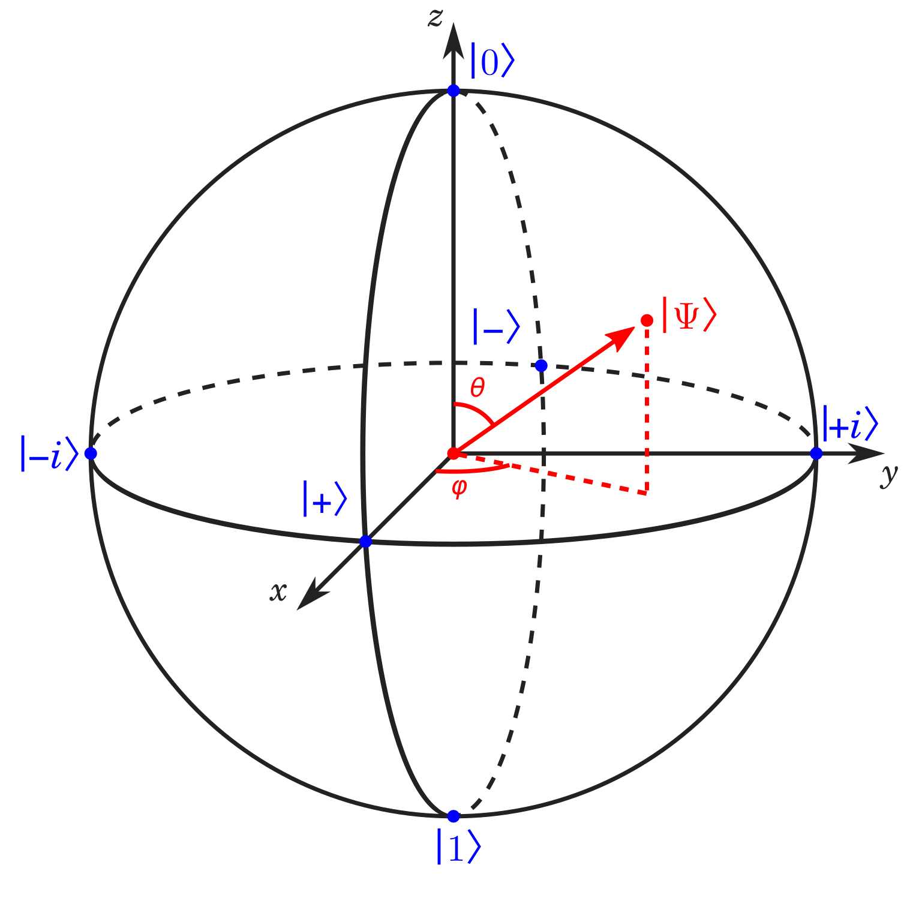
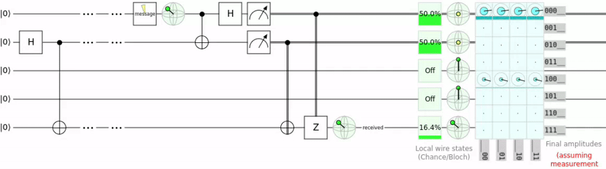
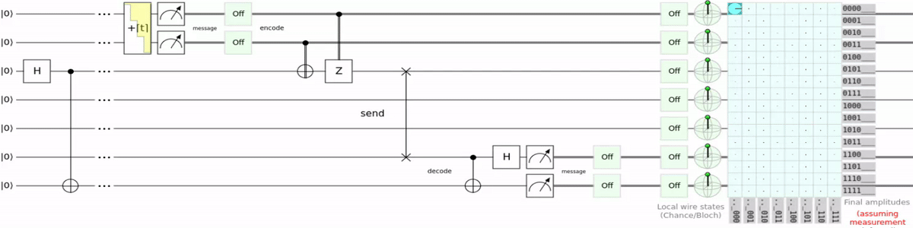
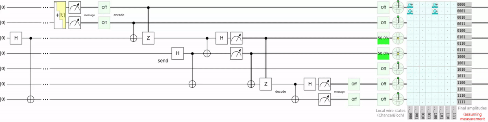

---
title:  "Quantum Computing With Q#"
layout: post
toc: true
---

## Intro 
Yes, this month's topic is quantum computing. I need to admit that this is a bit of an ambitious topic.
But if there's one thing I've learned in my life it's that you don't get far with reasonable ambitions, so let's get started!

The goal i set myself for this topic is to teleport a qubit and understand, at least at a basic level, how it works.
The reason i specifically chose the goal of teleporting a qubit is simply for the bragging rights of having done real life teleportation.
We will later go into why teleportation in quantum mechanics is not what we commonly think of as teleportation.

My main source for this topic is the tutorial section on https://microsoft.github.io/qsharp/.
Because, i know this may be hard to believe, but i don't have a degree in quantum mechanics.

## Some Math To Get Started
Quantum computing requires some pretty complex math. So before we get into the meat of it, we should probably take a look at some basic math concepts that are used in quantum computing.

If you are not already familiar with complex arithmetic and linear algebra, this is going to be a quite dense math lesson.
However, i highly recommend not to skip this section, even if these topics are new to you, because this stuff is fundamental to understanding the later sections.

### Complex Numbers
Complex numbers are numbers that consist of one real and one imaginary part.
I should probably explain what real and imaginary numbers are.
The first paragraph on the wikipedia page for real numbers says:

> In mathematics, a real number is a number that can be used to measure a continuous one-dimensional quantity such as a distance, duration or temperature.
> Here, continuous means that pairs of values can have arbitrarily small differences.
> Every real number can be almost uniquely represented by an infinite decimal expansion.

Ok, this might not be so helpful. Let's look see what an imaginary number is:

> An imaginary number is the product of a real number and the imaginary unit $i$, which is defined by its property $i^2 = −1$.
> The square of an imaginary number bi is $−b^2$. For example, $5i$ is an imaginary number, and its square is −25.
> The number zero is considered to be both real and imaginary.

So an imaginary number is a real amount of the imaginary unit $i$. 

The imaginary unit is defined as $i^2 = -1$. 
This formula can't be solved with real numbers, because there is no real number that when squared equals -1.
So, what did mathematicians do? Exactly, they made a number up.

> Natural numbers were created by God, everything else is the work of men — [Kronecker](https://en.wikipedia.org/wiki/Leopold_Kronecker) (1823–1891).

A complex number is the combination of a real and an imaginary number for example:
$-1 + 3i$ here -1, is the real part and $3i$ is the imaginary part.

We can do lots of calculations with complex number. 
I will however only highlight one here complex Conjugation.

$$
x \cdot \overline{x} = (a + bi) (a - bi)
$$

$$
(a + bi)(a - bi) = a^2 - (bi)^2 = a^2 - b^2i^2 = a^2 + b^2
$$

Applied to our previous example of $-1 + 3i$

$$
(-1 + 3i) (-1 - 3i)
$$

### Linear Algebra
Linear algebra is the study of properties of matrices and vectors.

#### Matrices
In quantum computing matrices are used to represent quantum states.
A matrix is a set of numbers arranged in a grid. Here is a 2 by 2 matrix:

$$
A =
\left\lceil
\begin{matrix}
1 & 2\\
3 & 4
\end{matrix}
\right\rceil
$$

A position in the matrix is written as $A_i,_j$ where $i$ is the row and $j$ is the column. So, in this example $A_1,_0 = 3$.
This is similar to how 2d arrays are accessed in many programming languages. (`array[i][j]` or `array[i,j]`)

There are a lot of operations we can do on matrices. Let's look at a few.

##### Matrix Addition

$$
\left\lceil
\begin{matrix}
1 & 2\\
3 & 4
\end{matrix}
\right\rceil +
\left\lceil
\begin{matrix}
1 & 2\\
3 & 4
\end{matrix}
\right\rceil =
\left\lceil
\begin{matrix}
2 & 4\\
6 & 8
\end{matrix}
\right\rceil
$$

##### Scalar Multiplication
One very common operation on matrices is the scalar multiplication.
In a scalar multiplication every element in the matrix is multiplied by a scalar:

$$
3 \cdot
\left\lceil
\begin{matrix}
1 & 2\\
3 & 4
\end{matrix}
\right\rceil =
\left\lceil
\begin{matrix}
3 & 6\\
9 & 12
\end{matrix}
\right\rceil
$$

##### Matrix Multiplication
Matrix multiplication is very unusual.
When multiplying 2 matrices, the x- and y-axes of the 2 operands and the result don't have to be the same size.
The rule is that the number of columns of the first matrix must be equal to the number of rows in the second matrix.

$$
\left\lceil
\begin{matrix}
5 & 10 & 15\\
20 & 25 & 30
\end{matrix}
\right\rceil
\left\lceil
\begin{matrix}
1 \\
2 \\
3 \\
\end{matrix}
\right\rceil =
\left\lceil
\begin{matrix}
5\cdot1 & 10\cdot2 & 15\cdot3\\
20\cdot1 & 25\cdot2 & 30\cdot3
\end{matrix}
\right\rceil =
\left\lceil
\begin{matrix}
5 & 20 & 45\\
20 & 50 & 90
\end{matrix}
\right\rceil
$$

We can also multiply matrices with equal columns and rows.

$$
\left\lceil
\begin{matrix}
1 & 2 \\
3 & 4
\end{matrix}
\right\rceil \cdot
\left\lceil
\begin{matrix}
5 & 6 \\
7 & 8 \\
\end{matrix}
\right\rceil =
\left\lceil
\begin{matrix}
1\cdot5 + 2\cdot7  & 1\cdot6 + 2\cdot8\\
3\cdot5 + 4\cdot7  & 3\cdot6 + 4\cdot8\\
\end{matrix}
\right\rceil =
\left\lceil
\begin{matrix}
19 & 22\\
43 & 50
\end{matrix}
\right\rceil
$$

Another unusual thing is that matrix multiplication is not commutative, meaning $AB$ rarely equals $BA$.

##### Invert A Matrix
Not all matrices are invertible. A matrix is invertible when the following is true:
$$
AA^{-1} = A^{-1}A = 
I_n
$$
$I$ is the [identity matrix](https://en.wikipedia.org/wiki/Identity_matrix) with $n$ columns and rows.
The identity matrix is best explained with an example:

$$
I_3 =
\left\lceil
\begin{matrix}
1 & 0 & 0\\
0 & 1 & 0\\
0 & 0 & 1
\end{matrix}
\right\rceil
$$

Ok, now how do we calculate the inverse of a matrix?
Let's go through the steps:

$$
A =
\left\lceil
\begin{matrix}
a & b\\
c & d
\end{matrix}
\right\rceil
$$

Step 1 calculate the determinant:

$$
\lvert A \rvert = a \cdot d - b \cdot c
$$

Step 2 calculate the inverse:

$$
A^{-1} = \frac 1 {\lvert A \rvert} \cdot
\left\lceil
\begin{matrix}
d & -b\\
-c & a
\end{matrix}
\right\rceil
$$

Now that we know the formula we can do an example.

$$
\left\lceil
\begin{matrix}
1 & 2\\
3 & 4
\end{matrix}
\right\rceil
$$

Again step 1 calculate the determination:

$$
\lvert A \rvert =
1 \cdot 4 - 2 \cdot 3
= -2
$$

Again step 2 calculate the inverse:

$$
A^{-1} = -\frac 1 2 \cdot
\left\lceil
\begin{matrix}
4 & -2\\
-3 & 1
\end{matrix}
\right\rceil =
\left\lceil
\begin{matrix}
-2 & 1\\
\frac 3 2 & -\frac 1 2
\end{matrix}
\right\rceil
$$

Now that we have $A^{-1}$ we can calculate the identity matrix.

$$
AA^{-1} =
\left\lceil
\begin{matrix}
1 & 2\\
3 & 4
\end{matrix}
\right\rceil
\left\lceil
\begin{matrix}
-2 & 1\\
\frac 3 2 & -\frac 1 2
\end{matrix}
\right\rceil =
\left\lceil
\begin{matrix}
1 \cdot -2 + 2 \cdot \frac 3 2 & 1 \cdot 1 + 2 \cdot -\frac 1 2\\
3 \cdot -2 + 4 \cdot \frac 3 2 & 3 \cdot 1 + 4 \cdot -\frac 1 2
\end{matrix}
\right\rceil =
\left\lceil
\begin{matrix}
1 & 0\\
0 & 1
\end{matrix}
\right\rceil
$$

I think there is something very satisfying about getting a simple result from a complex calculation. :)

##### Transpose Matrices
You can also transpose matrices. When transposing a matrix we calculate the [multiplicative inverse](https://en.wikipedia.org/wiki/Multiplicative_inverse) for $i$ and $j$ in $A_i,_j$ on each element.
This results in $i$ and $j$ "switching places", so $x_1,_0$ becomes $x_0,_1$. The transposition is annotated with $A^T$.

$$
\left\lceil
\begin{matrix}
1 & 2\\
3 & 4
\end{matrix}
\right\rceil ^ T =
\left\lceil
\begin{matrix}
1 & 3\\
2 & 4
\end{matrix}
\right\rceil
$$

##### Conjugate Of A Matrix
Now [Conjugation from before](#complex-numbers) becomes important.
When we conjugate a matrix we conjugate every element in the matrix.

$$
A =
\left\lceil
\begin{matrix}
x_0,_0 & x_0,_1\\
x_1,_0 & x_1,_1
\end{matrix}
\right\rceil
$$

$$
\overline{A} =
\left\lceil
\begin{matrix}
\overline{x}_0,_0 & \overline{x}_0,_1\\
\overline{x}_1,_0 & \overline{x}_1,_1
\end{matrix}
\right\rceil
$$

So, for example

$$
A =
\left\lceil
\begin{matrix}
1 + 5i & 2\\
3 - 6i & 4i
\end{matrix}
\right\rceil
$$

Would conjugate to this

$$
\overline{A} =
\left\lceil
\begin{matrix}
1 - 5i & 2\\
3 + 6i & -4i
\end{matrix}
\right\rceil
$$

As you may have noticed, this operation only affects the imaginary parts.

##### Adjoint Of A Matrix
The adjoint of a matrix combines the conjugate and transpose. 
The adjoint is defined as $A^{\dagger} = \overline{( A^T )} = (\overline{A})^T$.
To show how this works we can look at an example:

$$
A =
\left\lceil
\begin{matrix}
1 + 5i & 2\\
3 - 6i & 4i
\end{matrix}
\right\rceil
$$

It does not matter if we conjugate or transpose first. Here we conjugate first.

$$
\overline{A} =
\left\lceil
\begin{matrix}
1 - 5i & 2\\
3 + 6i & -4i
\end{matrix}
\right\rceil
$$

$$
\overline{A^T} =
\left\lceil
\begin{matrix}
1 - 5i & 3 + 6i\\
2 & -4i
\end{matrix}
\right\rceil
$$

There is one thing to add here. A [Hermitian or self-adjoint](https://en.wikipedia.org/wiki/Hermitian_matrix) is a matrix where $A = A^{\dagger}$.
An example of this is:

$$
\overline{A^T} =
\left\lceil
\begin{matrix}
1 & i\\
-i & 2
\end{matrix}
\right\rceil
$$

##### Unitary Matrices
A matrix is unitary when its inverse is equal to its adjoint: $U^{-1} = U^{\dagger}$.
That is, an $n \cdot n$ square matrix $U$ is unitary only if $UU^{\dagger} = U^{\dagger} U = I_n$.

This one took me a bit to understand. ^^\
Let's go through the steps to calculate if a matrix is unitary:

The matrix to check:

$$
A =
\left\lceil
\begin{matrix}
\frac 1 {\sqrt{2}} & \frac 1 {\sqrt{2}}\\
\frac i {\sqrt{2}} & \frac {-i} {\sqrt{2}}
\end{matrix}
\right\rceil =
\frac 1 {\sqrt{2}}
\left\lceil
\begin{matrix}
1 & 1\\
i & -i
\end{matrix}
\right\rceil
$$

The first thing we can do is simplify the square root.

Because $\frac 1 {\sqrt{2}} \cdot \frac 1 {\sqrt{2}} = \frac 1 2$ we can simplify to:

$$
\frac 1 2
\left\lceil
\begin{matrix}
1 & 1\\
i & -i
\end{matrix}
\right\rceil
\left\lceil
\begin{matrix}
1 & -i\\
1 & i
\end{matrix}
\right\rceil
$$

To calculate $AA^{\dagger} = I_n$ we need the adjoint of $A$.
The adjoint can be calculated from the conjugate and the transpose $A^{\dagger} = \overline{(A^T)}$

Step 1 get the conjugate

$$
\overline{A} =
\frac 1 2
\left\lceil
\begin{matrix}
1 & 1\\
-i & i
\end{matrix}
\right\rceil
$$

Step 2 transpose the conjugate

$$
\overline{(A^T)} =
\frac 1 2
\left\lceil
\begin{matrix}
1 & -i\\
1 & i
\end{matrix}
\right\rceil
$$

Now we have the adjoint of $A$. ($A^{\dagger}$)

Step 3 multiply the matrix by its adjoint ($AA^{\dagger}$)

$$
AA^{\dagger} =
\frac 1 2
\left\lceil
\begin{matrix}
1 & 1\\
i & -i
\end{matrix}
\right\rceil
\left\lceil
\begin{matrix}
1 & -i\\
1 & i
\end{matrix}
\right\rceil =
\frac 1 2
\left\lceil
\begin{matrix}
1 \cdot 1 + 1 \cdot 1 & 1 \cdot -i + 1 \cdot i\\
i \cdot 1 + -i \cdot 1 & i \cdot -i + -i \cdot i
\end{matrix}
\right\rceil =
\frac 1 2
\left\lceil
\begin{matrix}
2 & 0\\
0 & 2
\end{matrix}
\right\rceil =
\left\lceil
\begin{matrix}
1 & 0\\
0 & 1
\end{matrix}
\right\rceil
$$

Step 4 multiply the matrix by its adjoint ($A^{\dagger} A$)

$$
A^{\dagger} A =
\frac 1 2
\left\lceil
\begin{matrix}
1 & -i\\
1 & i
\end{matrix}
\right\rceil
\left\lceil
\begin{matrix}
1 & 1\\
i & -i
\end{matrix}
\right\rceil =
\frac 1 2
\left\lceil
\begin{matrix}
1 \cdot 1 + -i \cdot i & 1 \cdot 1 + -i \cdot -i\\
1 \cdot 1 + i \cdot i & 1 \cdot 1 + i \cdot -i
\end{matrix}
\right\rceil =
\frac 1 2
\left\lceil
\begin{matrix}
2 & 0\\
0 & 2
\end{matrix}
\right\rceil =
\left\lceil
\begin{matrix}
1 & 0\\
0 & 1
\end{matrix}
\right\rceil
$$

As we can see $AA^{\dagger} = A^{\dagger} A = I_n$.

#### Vectors
If you did some game development this topic might already be familiar to you.

##### Inner Product
The inner product is a matrix operation that is only applied to vectors.
Given two vectors $V$ and $W$ of the same size, there inner product is $\langle V, W \rangle$. This is defined as $V^{\dagger} W$.
Let's solve an example:

$$
V =
\left\lceil
\begin{matrix}
-6\\
9i
\end{matrix}
\right\rceil,
W =
\left\lceil
\begin{matrix}
3\\
-8
\end{matrix}
\right\rceil
$$

Calculate the adjoint for $V$

$$
\overline{V} =
\left\lceil
\begin{matrix}
-6\\
-9i
\end{matrix}
\right\rceil
$$

$$
\overline{(V^T)} =
\left\lceil
\begin{matrix}
-6 & -9i\\
\end{matrix}
\right\rceil
$$

Calculating the product of $V^{\dagger}$ and $W$

$$
V^{\dagger} W =
\left\lceil
\begin{matrix}
-6 & -9i\\
\end{matrix}
\right\rceil
\left\lceil
\begin{matrix}
3\\
-8
\end{matrix}
\right\rceil =
(-6) \cdot 3 + (-9i) \cdot (-8) =
-18 + 72i
$$

The result is $\langle V, W \rangle = -18 + 72i$

##### Normalizing A Vector
If you have done some game development you probably used this a ton. But if so, do you also know how it works?

The norm of a vector is defined as $\lVert V \rVert = \sqrt{\langle V, V \rangle}$ given a vector $V$.
For the vector $V = \left\lceil\begin{matrix}-6 \\\ -8i\end{matrix}\right\rceil$ we can calculate the normalized vector defined as $\frac V {\lVert V \rVert}$ the following:

First we calculate the norm ($\lVert V \rVert$)

$$
\lVert V \rVert =
\sqrt{\langle V, V \rangle} =
\sqrt{-6 \cdot -6 + -8i \cdot 8i} =
\sqrt{6^2 + 8^2} =
10
$$

Now we can get the normalized vector by dividing each element in the vector.

$$
\frac V {\lVert V \rVert} =
\left\lceil
\begin{matrix}
-0.6 \\
0.8i
\end{matrix}
\right\rceil =
\left\lceil
\begin{matrix}
\frac {-6} {10} \\
\frac {-8i} {10}
\end{matrix}
\right\rceil
$$

##### Outer Product
The outer product of two vectors $V$ and $W$ is defined as $VW^{\dagger}$.
The outer product of an $n \times 1$ vector and an $m \times 1$ vector is an $n \times m$ matrix.
If we denote the outer product of $V$ and $W$ as $X$, then $X_i,_j = V_i \cdot \overline{W_j}$.\
Let's calculate the outer product ($VW^{\dagger}$) for the following two vectors.

$$
V =
\left\lceil
\begin{matrix}
-3i \\
9
\end{matrix}
\right\rceil,
W =
\left\lceil
\begin{matrix}
9i \\
2
\end{matrix}
\right\rceil
$$

First we calculate $W^{\dagger}$

$$
\overline{W} =
\left\lceil
\begin{matrix}
-9i \\
2
\end{matrix}
\right\rceil
$$

$$
\overline{(W^T)} =
\left\lceil
\begin{matrix}
-9i & 2
\end{matrix}
\right\rceil
$$

After that we calculate $VW^{\dagger}$

$$
VW^{\dagger} =
\left\lceil
\begin{matrix}
-3i \\
9
\end{matrix}
\right\rceil
\left\lceil
\begin{matrix}
-9i & 2
\end{matrix}
\right\rceil =
\left\lceil
\begin{matrix}
-3i \cdot -9i & -3i \cdot 2 \\
9 \cdot -9i & 9 \cdot 2
\end{matrix}
\right\rceil =
\left\lceil
\begin{matrix}
-27 & -6i \\
-81i & 18
\end{matrix}
\right\rceil
$$

##### Tensor Product
The tensor product is a different way of multiplying matrices.
Here we multiply the second matrix by every element in the first matrix.
For an $n \times m$ matrix $A$ and an $k \times l$ matrix $B$, there tensor product $A \otimes B$ is an $(n \cdot l) \times (m \cdot l)$ matrix.
An example of this is:

$$
A =
\left\lceil
\begin{matrix}
1 & 2 \\
3 & 4
\end{matrix}
\right\rceil
B =
\left\lceil
\begin{matrix}
5 & 6 \\
7 & 8
\end{matrix}
\right\rceil
$$

$$
A \otimes B =
\left\lceil
\begin{matrix}
1 \cdot B & 2 \cdot B \\
3 \cdot B & 4 \cdot B
\end{matrix}
\right\rceil =
\left\lceil
\begin{matrix}
\left\lceil\begin{matrix}5 & 6 \\ 7 & 8\end{matrix}\right\rceil & \left\lceil\begin{matrix}10 & 12 \\ 14 & 16\end{matrix}\right\rceil\\
\left\lceil\begin{matrix}15 & 18 \\ 21 & 24\end{matrix}\right\rceil & \left\lceil\begin{matrix}20 & 24 \\ 28 & 32\end{matrix}\right\rceil
\end{matrix}
\right\rceil =
\left\lceil
\begin{matrix}
5 & 6 & 10 & 12 \\
7 & 8 & 14 & 16 \\
15 & 18 & 20 & 24 \\
21 & 24 & 28 & 32
\end{matrix}
\right\rceil
$$

### Math Closing Notes
If you went through the entire math section let me applaud you. It's a lot, but you now have the required knowledge to understanding the coming sections.

## The Qubit
Regular computers work with bits which have the state 1 and 0. Quantum computers work with qubits, which can be 0, 1 or any state in between.
The state of a qubit is represented by a complex vector of size 2: $\left\lceil\begin{matrix}\alpha \\ \beta\end{matrix}\right\rceil$
Here $\alpha$ and $\beta$ are complex numbers. $\alpha$ represents how "close" the qubit is to state 0, and $\beta$ represents how "close" the qubit is to state 1.
So, a qubit that is in state 0 would be represented by the vector $\left\lceil\begin{matrix}1 \\ 0\end{matrix}\right\rceil$ and a qubit in state 1 by the vector $\left\lceil\begin{matrix}0 \\ 1\end{matrix}\right\rceil$.

### Dirac Notation
Dirac notation is a shorthand notation for states of qubits. In Dirac notation, vectors are denoted by the symbols bra and ket. For example the qubit state 0 becomes $\lvert 0 \rangle$. \

*Ket*

$$
\lvert 0 \rangle = \left\lceil\begin{matrix}1 \\ 0\end{matrix}\right\rceil
$$

$$
\lvert 1 \rangle = \left\lceil\begin{matrix}0 \\ 1\end{matrix}\right\rceil
$$

$$
\lvert \psi \rangle = \left\lceil\begin{matrix}\alpha \\ \beta\end{matrix}\right\rceil
$$

*Bra*

$$
\langle 0 \rvert = \left\lceil\begin{matrix}1 & 0\end{matrix}\right\rceil
$$

$$
\langle 1 \rvert = \left\lceil\begin{matrix}0 & 1\end{matrix}\right\rceil
$$

$$
\langle \psi \rvert= \left\lceil\begin{matrix}\overline{\alpha} \overline{\beta}\end{matrix}\right\rceil
$$

We can see that ket represents a column vector and bra a row one. The important thing here is that the bra representation is the [adjoint](#adjoint-of-a-matrix) of the ket representation.
For example $\langle \psi \rvert = \lvert \psi \rangle^{\dagger}$. If you recall the [inner product](#inner-product) is defined as $V^{\dagger} W$ and the [outer product](#outer-product) as $VW^{\dagger}$.
Given the two vectors $\lvert \psi \rangle$ and $\lvert \phi \rangle$ there inner product is:

$$
\lvert \psi \rangle^{\dagger} \lvert \phi \rangle =
\langle \psi \vert \phi \rangle
$$

and there outer product is:

$$
\lvert \psi \rangle \lvert \phi \rangle^{\dagger} =
\lvert \psi \rangle \langle \phi \rvert
$$

Also

$$
\lVert \lvert \psi \rangle \rVert = \sqrt{\langle \psi \vert \psi \rangle}
$$

### Qubit Gates
When qubits are measured they collapse into a 0 or a 1. So we can't directly modify or measure them. 
But we modify them indirectly with gates. These gates work similarly to gates as we know them from regular computers.
As an example, an arbitrary quantum gate $A$:

$$
A =
\left\lceil
\begin{matrix}
\Omega & \pi \\
\tau & \gamma
\end{matrix}
\right\rceil
$$

Applied to $\lvert 0 \rangle$ and $\lvert 1 \rangle$

$$
A \lvert 0 \rangle =
\left\lceil
\begin{matrix}
\Omega & \pi \\
\tau & \gamma
\end{matrix}
\right\rceil
\left\lceil
\begin{matrix}
1 \\
0
\end{matrix}
\right\rceil =
\left\lceil
\begin{matrix}
\Omega \cdot 1 + \pi \cdot 0  \\
\tau \cdot 1 + \gamma \cdot 0
\end{matrix}
\right\rceil =
\left\lceil
\begin{matrix}
\Omega\\
\tau
\end{matrix}
\right\rceil =
\Omega \lvert 0 \rangle + \tau \lvert 1 \rangle
$$

$$
A \lvert 1 \rangle =
\left\lceil
\begin{matrix}
\Omega & \pi \\
\tau & \gamma
\end{matrix}
\right\rceil
\left\lceil
\begin{matrix}
0 \\
1
\end{matrix}
\right\rceil =
\left\lceil
\begin{matrix}
\Omega \cdot 0 + \pi \cdot 1  \\
\tau \cdot 0 + \gamma \cdot 1
\end{matrix}
\right\rceil =
\left\lceil
\begin{matrix}
\pi \\
\gamma
\end{matrix}
\right\rceil =
\pi \lvert 0 \rangle + \gamma \lvert 1 \rangle
$$

#### Single Qubit Gates

##### Pauli-X (NOT Gate)

$$
X =
\left\lceil
\begin{matrix}
0 & 1 \\
1 & 0
\end{matrix}
\right\rceil
$$

$$
X \lvert 0 \rangle =
\left\lceil
\begin{matrix}
0 \\
1
\end{matrix}
\right\rceil =
\lvert 1 \rangle
$$

This is similar to hoe the not gate in boolean algebra works:

$$
\lnot X
$$

$$
\lnot 1 = 0
$$

One additional thing to mention here is that we can use the ket-bra representation instead of matrices to represent gates.

$$
X = \lvert 0 \rangle \langle 1 \rvert + \lvert 1 \rangle \langle 0 \rvert =
\left\lceil
\begin{matrix}
1 \\
0
\end{matrix}
\right\rceil
\left\lceil
\begin{matrix}
0 & 1
\end{matrix}
\right\rceil +
\left\lceil
\begin{matrix}
0 \\
1
\end{matrix}
\right\rceil
\left\lceil
\begin{matrix}
1 & 0
\end{matrix}
\right\rceil =
\left\lceil
\begin{matrix}
0 & 1 \\
0 & 0
\end{matrix}
\right\rceil +
\left\lceil
\begin{matrix}
0 & 0 \\
1 & 0
\end{matrix}
\right\rceil =
\left\lceil
\begin{matrix}
0 & 1 \\
1 & 0
\end{matrix}
\right\rceil
$$

$$
\lvert 0 \rangle \langle 1 \rvert + \lvert 1 \rangle \langle 0 \rvert =
\left\lceil
\begin{matrix}
0 & 1 \\
1 & 0
\end{matrix}
\right\rceil
$$

##### Pauli-Y

$$
Y =
\left\lceil
\begin{matrix}
0 & -i \\
i & 0
\end{matrix}
\right\rceil
$$

##### Pauli-Z

$$
Z =
\left\lceil
\begin{matrix}
1 & 0 \\
0 & -1
\end{matrix}
\right\rceil
$$

##### Hadamard Gate (H Gate)
This gate sets $\lvert 0 \rangle$ and $\lvert 1 \rangle$ to the super positions $\lvert + \rangle$ and $\lvert - \rangle$, respectively.

$$
H =
\left\lceil
\begin{matrix}
\frac {1} {\sqrt{2}} & \frac {1} {\sqrt{2}} \\
\frac {1} {\sqrt{2}} & -\frac {1} {\sqrt{2}}
\end{matrix}
\right\rceil =
\frac {1} {\sqrt{2}}
\left\lceil
\begin{matrix}
1 & 1 \\
1 & -1
\end{matrix}
\right\rceil
$$

#### Quantum Circuits
Before we go into multi qubit gates let's first understand quantum circuits.
Quantum circuits are similar to circuits of regular bits and gates.
I will use [Quirk](https://algassert.com/quirk) to create and simulate these circuits.
One of the benefits of this quantum circuit simulator is that the entire circuit is saved in the URL.
So in the following quantum circuit examples i will always add a link to view the circuit on Quirk.

\
[Link](https://algassert.com/quirk#circuit={"cols":[["H"]]})

Each horizontal line represents a qubit with the start state displayed on the left and the outcome on the right.
On the right the outcome is displayed in different forms. First is the chance of measuring a 1.
Next is a Bloch sphere plot. Finally, there is a representation of the amplitudes.

If we look at the complete editor:



We can see the different elements we can drag onto the circuit.
In the previous example we see that an H gate was dragged onto the line of the first qubit.

#### Multi Qubit Gates
Multi qubit gates are gates which act on multiple qubits.

##### CNOT Gate (Controlled NOT Gate)

$$
CNOT =
\left\lceil
\begin{matrix}
1 & 0 & 0 & 0 \\
0 & 1 & 0 & 0 \\
0 & 0 & 0 & 1 \\
0 & 0 & 1 & 0 \\
\end{matrix}
\right\rceil
$$

This matrix probably does not help much to understand what the CNOT gate does.
So Lets look at a quantum circuit:

\
[Link](https://algassert.com/quirk#circuit={"cols":[[1,"H"],["X","•"]]})

In this circuit an H gate is applied to the second qubit. So it has a 50% chance to be 1. After that there is a CNOT gate.
This gate has 2 components on the upper line there is an X gate (in a controlled gate this is called the "target") and on the lower line there is a control.
This control decides if the X gate is active or not. if the control gets a 1 the X gate will be active and if it gets a 0 the X gate is inactive.
Now because the control gets a qubit that is in a 50/50 super position the X gate also has a 50% chance of being active.
this puts the first qubit also in a super position. If we now measure one of them we automatically know the state of the other.
This is called [quantum entanglement](https://en.wikipedia.org/wiki/Quantum_entanglement).

##### CZ Gate (Controlled Z Gate)

$$
CZ =
\left\lceil
\begin{matrix}
1 & 0 & 0 & 0 \\
0 & 1 & 0 & 0 \\
0 & 0 & 1 & 0 \\
0 & 0 & 0 & -1 \\
\end{matrix}
\right\rceil
$$

The CZ gate works the same as the CNOT gate but instead of the X gate the Z gate is being controlled. 
A special feature of the CZ gate is that it is symmetric, i.e. it does not matter which qubit is used as the control and which as the target. 

### Bloch Sphere
Since the state of a qubit can be represented by a vector, we can visualize it geometrically.



This is the [Bloch Sphere](https://en.wikipedia.org/wiki/Bloch_sphere).
$\vert \psi \rangle$ represents the state of the qubit as $\vert \psi \rangle = \left\lceil\begin{matrix}\alpha \\\ \beta\end{matrix}\right\rceil$.

Notice that there are also 6 other marked positions $\lvert 0 \rangle$, $\lvert 1 \rangle$, $\lvert -i \rangle$, $\lvert +i \rangle$, $\lvert - \rangle$ and $\lvert + \rangle$.
These are the basis states for the x-, y-, and z-axes. These are states we commonly deal with so they have their own notations.

This is all very abstract and theoretical, so i made an interactive bloch sphere in javascript.
I was certainly not the first person to do this but i wanted to put my new gained knowledge on complex arithmetic, linear algebra and qubit gates to the test.
As a challenge i also did not use [mathjs](https://mathjs.org/), so that i had to implement complex numbers and matrices myself including the operations on them with only the basic built-in math library.
It ended up being a bit challenging, but the struggle was 100% worth it. Because for this my calculations needed to be correct and i could also verify that by comparing my results with the results from other implementations.
This project also introduced me to additional topics like the [polar coordinate system](https://en.wikipedia.org/wiki/Polar_coordinate_system) and [Euler's formula](https://en.wikipedia.org/wiki/Euler%27s_formula). If you are interested in my implementation.
The source code for the project is available on my GitHub under [Teddy55Codes/BlochSphere](https://github.com/Teddy55Codes/BlochSphere).

<div id="blochsphere"></div>
<script src="../../Resources/24.06/InteractiveBlochSphere/interactive-bloch-sphere-packed-v0.2.js"></script>
<script>
new InteractiveBlochSphere.InteractiveBlochSphere(document.getElementById("blochsphere"));
</script>

## Teleportation
The [no-cloning theorem](https://en.wikipedia.org/wiki/No-cloning_theorem) states that it is impossible to clone a qubit. 
That means that we can't just copy a qubit like we can with regular bits. The way we move qubits in quantum computing is via teleportation.

Here is the circuit for such a teleportation.



[Link](https://algassert.com/quirk#circuit={"cols":[[1,"H"],[1,"•",1,1,"X"],["…","…",1,1,"…"],["…","…",1,1,"…"],["~87lj"],["Bloch"],["•","X"],["H"],["Measure","Measure"],[1,"•",1,1,"X"],["•",1,1,1,"Z"],[1,1,1,1,"Bloch"],[1,1,1,1,"~f7c0"]],"gates":[{"id":"~87lj","name":"message","circuit":{"cols":[["e^-iYt"],["X^t"]]}},{"id":"~f7c0","name":"received","matrix":"{{1,0},{0,1}}"}]})


To explain this a bit further we take the scenario of Alice wanting to send a message to Bob.
The circuit required for this uses 3 qubits. On line one we have the message qubit (qMessage), on line two we have Alice's qubit (qAlice), and on the last line we have Bob's qubit (qBob).

1. Entangle qAlice and qBob. This is done with an H and a CNOT gate where qAlice is the control.
2. qMessage is entangled with qAlice.
3. qMessage and qAlice are both measured which causes them to collapse into a 1 or 0. (This destroys the original qMessage and dus does not violate the no-cloning theorem.)
4. The 2 resulting 2 bits are transmitted to Bob.
5. The 2 regular bits can now be used to recreate the state of qMessage

Did you notice that in order to reconstruct qMessage the 2 regular bits where required? 
This is the reason i said that quantum teleportation is not what we usually under stand as teleportation.
Because we need the result of the measurement we can not actually transport information faster than usual.

## Superdense Coding
In superdense coding instead of moving one qubit, we move 2 regular bits, which is why superdense coding is also called the inverse of teleportation.



[Link](https://algassert.com/quirk#circuit={"cols":[[1,1,"H"],[1,1,"•",1,1,1,"X"],["…","…","…","…","…","…","…"],["Counting2"],["Measure","Measure"],["~msg"],["Chance","Chance"],["~enc"],[1,"•","X"],["•",1,"Z"],[1,1,1,"~send"],[1,1,"Swap",1,1,"Swap"],[1,1,1,1,1,"~dec"],[1,1,1,1,1,"•","X"],[1,1,1,1,1,"H"],[1,1,1,1,1,"Measure","Measure"],[1,1,1,1,1,"~msg"],[1,1,1,1,1,"Chance","Chance"]],"gates":[{"id":"~msg","name":"message","matrix":"{{1,0,0,0},{0,1,0,0},{0,0,1,0},{0,0,0,1}}"},{"id":"~enc","name":"encode","matrix":"{{1,0,0,0},{0,1,0,0},{0,0,1,0},{0,0,0,1}}"},{"id":"~send","name":"send","matrix":"{{1,0,0,0},{0,1,0,0},{0,0,1,0},{0,0,0,1}}"},{"id":"~dec","name":"decode","matrix":"{{1,0,0,0},{0,1,0,0},{0,0,1,0},{0,0,0,1}}"}]})


## Basics Of Q#
Q# is a [DSL](https://en.wikipedia.org/wiki/Domain-specific_language) for quantum computers. Its syntax looks a lot like Rust with a bit of F# sprinkled in probably because it is written in Rust and the previous implementation was written in C# and F#. 

### Qubits in Q#
Qubits are represented by the `Qubit` type in Q#. As mentioned [earlier](#qubit-gates) we can't directly access the state of a qubit without it collapsing into a 1 or a 0.
This means you can not read or write the exact value of a qubit. The `Qubit` type in Q# has been designed to represent that behavior.
For example to allocate a new qubit the use statement is used. It woks similar to the using statement in C#.
In the sense that when going out of the scope where the qubit was allocated the qubit gets freed.

```qsharp
use q = Qubit();
```

Qubits always start in the $\lvert 0 \rangle$ state and have to be set back to that state before being freed otherwise a runtime error will be thrown.

### Gates In Q#
In Q# gates are methods which take a `Qubit` as input and return void. This means they change the state of the qubit that was provided.
Gates are placed under the `Microsoft.Quantum.Intrinsic` namespace in Q#.
As an example here is the X gate in action:
```qsharp
@EntryPoint()
operation XGateExample() : Result {
    use q = Qubit();

    X(q);

    let res = M(q);
    Reset(q);
    return res;
}
```
In this code we allocate a qubit, apply the X gate, measure the qubit with the `M` method, reset its value (otherwise a runtime error would be thrown see: [Qubits in Q#](#qubits-in-q)) and then return the measurement result.
Measurement results are ether `One` or `Zero`. In this case we always get `One`. The calculation we are doing here is quite simple it is $X\lvert 0 \rangle = \lvert 1 \rangle$.

We can also use multi qubit gates. For example the CNOT gate.
```qsharp
@EntryPoint()
operation CNOTGateExample() : (Result, Result) {
    use q1 = Qubit();
    use q2 = Qubit();

    H(q1);
    CNOT(q1, q2);

    let resQ1 = M(q1);
    let resQ2 = M(q2);
    Reset(q1);
    Reset(q2);
    return (resQ1, resQ2);
}
```
Here `q1` is the control and `q2` is the target.
You might remember this circuit from [before](#cnot-gate-controlled-not-gate). It is an example of quantum entanglement.
this means the return here will be `(One, One)` 50% of the time and the other 50% of the time it will be `(Zero, Zero)`.

## Running Quantum Code
Most of the time when you run your quantum program you do it on a simulator. This has many advantages:
1. Running you code on an actual quantum computer is very expensive because quantum computers are very expensive to develop, build, run and maintain plus there are not that many in existence.
2. Simulators can be run on normal computers.
3. With simulators, you can break the rules. In a simulator nothing is stopping you from directly read and write the state of a qubit. 
4. In a simulator it is also possible to use a debugger which is immensely helpful.

### Getting Started With the QDK (Q# Simulation)
To get started with Q# development you need the Azure Quantum Development Kit sort QDK. 
The easiest way to get the QDK is via the vs code plugin. Here is a step by step guid:

1. Get the QDK by adding the [QDK extension](https://marketplace.visualstudio.com/items?itemName=quantum.qsharp-lang-vscode) to your vs code. 
2. Create a file with the extension "qs". 
3. Paste this code into the file:
   ```qsharp
   namespace HelloWorld {
       @EntryPoint()
       operation HelloWorld() : Unit {
           Message("Hello World");
       }
   }
   ```
4. Press F5 or the Run button. The output should look something like this:
   ```
   Hello World
   Result: "()"
   Finished shot 1 of 1
   
   Q# simulation completed.
   ```

### QDK target profiles
There are 3 different targets profiles Unrestricted, QIR Adaptive RI and QIR base. Each having progressively more restrictions.

First the Unrestricted profile, it can run any Q# program. This profile is meant for running in a simulator.
In this configuration we can do things that would not be possible on an actual quantum computer. 
This includes observing the state of a qubit without its state being effected. In Q# we can do this via the `DumpMachine` method.
```qsharp
namespace DumpMachineExample {
    open Microsoft.Quantum.Diagnostics;

    @EntryPoint()
    operation DumpMachineExample() : Result {
        use q = Qubit();

        H(q);
        DumpMachine();
        
        let result = M(q);
        Reset(q);
        return result;
    }
}
```
Example Result:
```
DumpMachine:

 Basis | Amplitude      | Probability | Phase
 -----------------------------------------------
   |0⟩ |  0.7071+0.0000𝑖 |    50.0000% |   0.0000
   |1⟩ |  0.7071+0.0000𝑖 |    50.0000% |   0.0000
Result: "One"
Finished shot 1 of 1

Q# simulation completed.
```

The QIR Adaptive RI profile has only minimal constraints. this profile still allows us to do measurement-based conditional operations. 
This means we can do mid-circuit measurements and create conditions based on the results of these measurements. The problem is this profile is currently only supported on Quantinuum QPUs H1-1 and H2-1.

The last profile QIR base has the most restrictions but can also run on more quantum computers. 
This profile does not allow for mid-circuit measurements.  

## Running Q# On Azure
Q# is a language specific to Azure so there is no choice in cloud provider if we want to run Q#.

### Choosing a Quantum provider
As mentioned [before](#qdk-target-profiles) not all quantum computers can run all quantum code. 
Because i want to run a teleportation and teleportation requires mid-circuit measurements i need to choose a quantum computer that supports the QIR Adaptive RI profile. 
This already narrows the selection down to only 2. The [Quantinuum H1](https://www.quantinuum.com/hardware/h1) and the [Quantinuum H2](https://www.quantinuum.com/hardware/h2). 

Now because i am using free credits i only have the H1 available the H2 is only for the highest subscription tier.

### Teleporting ":3"
I wrote a Q# script which encodes text into qubits, teleports them, and decodes the text again. Saying it like this makes my code sound way too reasonable. 
To understand why my code only exists for bragging rights let's first look at the circuit:



[Link](https://algassert.com/quirk#circuit={"cols":[[1,1,"H"],[1,1,"•",1,1,1,"X"],["…","…","…","…","…","…","…"],["Counting2"],["Measure","Measure"],["~msg"],["Chance","Chance"],["~enc"],[1,"•","X"],["•",1,"Z"],[1,1,1,"~send"],[1,1,1,"H"],[1,1,1,"•",1,"X"],[1,1,"•","X"],[1,1,"H"],[1,1,"Measure","Measure"],[1,1,1,"•",1,"X"],[1,1,"•",1,1,"Z"],[1,1,1,1,1,"~dec"],[1,1,1,1,1,"•","X"],[1,1,1,1,1,"H"],[1,1,1,1,1,"Measure","Measure"],[1,1,1,1,1,"~msg"],[1,1,1,1,1,"Chance","Chance"]],"gates":[{"id":"~msg","name":"message","matrix":"{{1,0,0,0},{0,1,0,0},{0,0,1,0},{0,0,0,1}}"},{"id":"~enc","name":"encode","matrix":"{{1,0,0,0},{0,1,0,0},{0,0,1,0},{0,0,0,1}}"},{"id":"~send","name":"send","matrix":"{{1,0,0,0},{0,1,0,0},{0,0,1,0},{0,0,0,1}}"},{"id":"~dec","name":"decode","matrix":"{{1,0,0,0},{0,1,0,0},{0,0,1,0},{0,0,0,1}}"}]})


As the name suggests it is superdense coding using teleportation. So instead of a switch gate to transport the qubit teleportation is used.
This is super unnecessary and just requires more qubits to do the same thing, but now i can say i teleported ":3". 
For the source code and a more detailed explanation you can go checkout the [GitHub repository](https://github.com/Teddy55Codes/superdense-coding-with-teleportation) for the script.

### Result
So how did i teleport ":3"? If you remember from the [superdense coding](#superdense-coding) section, superdense coding allows us to transport 2 regular bits with 1 qubit.
And because my script is just superdense coding with extra steps it works the same here. ":3" in ASCII is 00111010 00110011.
The scripts output is the result of the teleportation. So if everything worked correctly we should get that as the output.

I ran the script for 10 shots. This means the script is run 10 times.
I got 2 output files in Azure. The [raw output](../../Resources/24.06/AzureFiles/rawOutputData) and a histogram. 

Let's look at the histogram:
```json
{
    "Histogram":
    [
        "[0, 0, 1, 1, 1, 0, 1, 0, 0, 0, 1, 1, 0, 0, 1, 1]",0.8,
        "[0, 0, 1, 1, 1, 0, 1, 0, 0, 0, 0, 1, 0, 0, 1, 1]",0.1,
        "[0, 0, 1, 1, 1, 0, 1, 0, 0, 0, 1, 1, 0, 0, 0, 1]",0.1
    ]
}
```
The items in "Histogram" are all the different outputs that where recorded. In this formatting on the left is the result value and on the right is how often that result occurred. 
Knowing that we can see that 8 out of 10 shots ran successfully. This is because quantum computers are not 100% accurate. 
This is the reason you do multiple shots even when the result should always be the same as it is the case with this script. 

### Cost
As of writing, Microsoft is giving every new user \\$500 worth of "Azure Quantum Credits" for each quantum provider which can be used for 6 months after creating your first Azure Quantum Workspace. 
Running my script on the Quantinuum H1 cost 7.11 "Azure Quantum Credits" which translates to \\$89.

## Closing Notes
This month i yet again went completely over board which yet again caused a huge delay. I'm not sure if i will ever learn from my mistakes.
Next month i will write about Webassembly. I hope i can finish that one with less then a month delay.

As always i hope you enjoyed reading this months post. :)

<script>
MathJax = {
  tex: {
    inlineMath: [['$', '$']],
    processEscapes: true
  },
};
</script>
<script type="text/javascript" id="MathJax-script" async
  src="https://cdn.jsdelivr.net/npm/mathjax@3/es5/tex-chtml.js">
</script>
